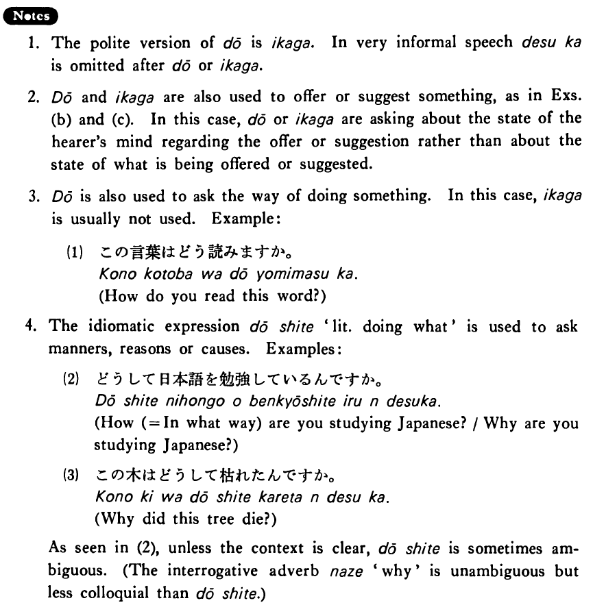

# どう

[1. Summary](#summary) 
[2. Example Sentences](#example-sentences) 
[3. Explanation](#explanation) 
[4. Grammar Book Page](#grammar-book-page) 

## Summary

<table><tr>   <td>Summary</td>   <td>An interrogative adverb which asks about the state of someone/something or the way of doing something.</td></tr><tr>   <td>Equivalent</td>   <td>How; in what way</td></tr><tr>   <td>Part of speech</td>   <td>Adverb</td></tr></table>

## Example Sentences

<table><tr>   <td>お母さんさんはどう（ですか）。</td>   <td>How's your mother?</td></tr><tr>   <td>新しいアパートはどうですか。</td>   <td>How's your new apartment?</td></tr><tr>   <td>コーヒーはどうですか。</td>   <td>How is the coffee?/Would you like coffee?/How about coffee?</td></tr><tr>   <td>土曜日はどう？</td>   <td>How about Saturday?</td></tr></table>

## Explanation

1. The polite version of どう is いかが. In very informal speech ですか is omitted after どう or いかが.
  
2. どう and いかが are also used to offer or suggest something, as in Examples (b) and (c). In this case, どう or いかが are asking about the state of the hearer's mind regarding the offer or suggestion rather than about the state of what is being offered or suggested.
  
3. どう is also used to ask the way of doing something. In this case, いかが is usually not used. Example:
  <ul>(1) <li>この言葉はどう読みますか。</li> <li>How do you read this word?</li> </ul>  
4. The idiomatic expression どうして 'literally: doing what' is used to ask manners, reasons or causes. Examples:
  <ul>(2) <li>どうして日本語を勉強しているんですか。</li> <li>How (= In what way) are you studying Japanese?/Why are you studying Japanese?</li> </ul>  <ul>(3) <li>この木はどうして枯れたんですか。</li> <li>Why did this tree die?</li> </ul>  
As seen in (2), unless the context is clear, どうして is sometimes ambiguous. (The interrogative adverb なぜ 'why' is unambiguous but less colloquial than どうして.)

## Grammar Book Page

