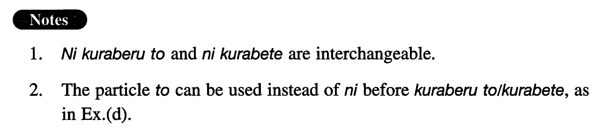

# に比べると/比べて

[1. Summary](#summary) 
[2. Formation](#formation) 
[3. Example Sentences](#example-sentences) 
[4. Grammar Book Page](#grammar-book-page) 

## Summary

<table><tr>   <td>Summary</td>   <td>If we compare (it) with/to; comparing (it) with.</td></tr><tr>   <td>English</td>   <td>Compared with/to; when compared with/to; in comparison to</td></tr><tr>   <td>Part of speech</td>   <td>Compound Particle</td></tr></table>

## Formation

<table class="table"><tbody><tr class="tr head"><td class="td">Noun</td><td class="td">に比べると/比べて</td><td class="td"></td></tr><tr class="tr"><td class="td"></td><td class="td">去年に比べると/比べて</td><td class="td">Compared with last year</td></tr></tbody></table>

## Example Sentences

<table><tr>   <td>欧米に比べて日本の住宅事情は極めて貧困だ。</td>   <td>Compared to (the situations) in Europe and the U.S., the housing situation in Japan is extremely poor.</td></tr><tr>   <td>日本に来る前に比べると今は大分日本語でものが言えるようになった。</td>   <td>I can speak Japanese fairly well now (literally: I have become able to say things in Japanese fairly well) compared to my level before I came to Japan.</td></tr><tr>   <td>今年は去年に比べて雨の日が多いようだ。</td>   <td>In comparison to last year, we seem to have more rainy days this year.</td></tr><tr>   <td>十年前の暮らしに比べると今の暮らしは天国です。</td>   <td>Compared with our life ten years ago, our present life is heavenly (literally: is heaven).</td></tr><tr>   <td>この新しい（コンピュータ）モデルは、古いモデルと比べて演算が三倍速くなっている。</td>   <td>When compared with the older (computer) model, the operation speed of this new model is three times as fast.</td></tr></table>

## Grammar Book Page

