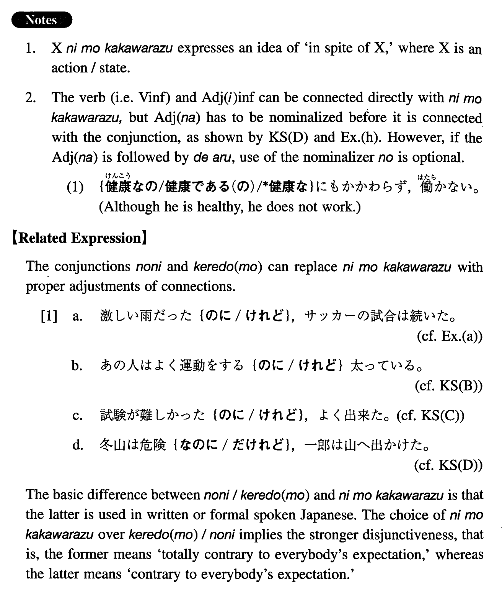

# にもかかわらず

[1. Summary](#summary) 
[2. Formation](#formation) 
[3. Example Sentences](#example-sentences) 
 

## Summary

<table><tr>   <td>Summary</td>   <td>Without any relation to a preceding event/situation.</td></tr><tr>   <td>English</td>   <td>Although; though; in spite of; despite; notwithstanding; nevertheless</td></tr><tr>   <td>Part of speech</td>   <td>Compound Particle/Conjunction (used in writing and formal speech only)</td></tr><tr>   <td>Related expression</td>   <td>けれど(も); のに</td></tr></table>

## Formation

<table class="table"><tbody><tr class="tr head"><td class="td">(i) Noun {Ø/なの/である(の)/だった(の)/であった(の)}</td><td class="td">にもかかわらず</td><td class="td"></td></tr><tr class="tr"><td class="td"></td><td class="td">先生{Ø/なの/である(の)/だった(の)/であった(の)}にもかかわらず</td><td class="td">In spite of being/having been a teacher</td></tr><tr class="tr head"><td class="td">(ii) Vinformal (の) </td><td class="td">にもかかわらず</td><td class="td"></td></tr><tr class="tr"><td class="td"></td><td class="td">{勉強する/勉強した}(の) にもかかわらず</td><td class="td">In spite of studying/having studied</td></tr><tr class="tr head"><td class="td">(iii) Adjective い informal (の) </td><td class="td">にもかかわらず</td><td class="td"></td></tr><tr class="tr"><td class="td"></td><td class="td">{つまらない/つまらなかった}(の) にもかかわらず</td><td class="td">Although something is/was boring</td></tr><tr class="tr head"><td class="td">(iv) Adjective な stem{なの/である(の)/だった(の)/であった(の)}</td><td class="td">にもかかわらず</td><td class="td"></td></tr><tr class="tr"><td class="td"></td><td class="td">元気{なの/である(の)/だった(の)/であった(の)}にもかかわらず</td><td class="td">Although someone is/was healthy</td></tr></tbody></table>

## Example Sentences

<table><tr>   <td>懸命な努力にもかかわらず、健一は大学入試に失敗した。</td>   <td>In spite of his strenuous efforts, Ken'ichi failed the college entrance examination.</td></tr><tr>   <td>あの人はよく運動をする（の）にもかかわらず、太っている。</td>   <td>He is fat, although he exercises a lot.</td></tr><tr>   <td>試験が難しかった（の）にもかかわらず、よく出来た。</td>   <td>Although the exam was hard, I did well.</td></tr><tr>   <td>冬山は危険なのである（の）にもかかわらず、一郎は山へ出かけた。</td>   <td>Although winter mountains are dangerous, Ichiro left for the mountain.</td></tr><tr>   <td>激しい雨（だった）にもかかわらず、サッカーの試合は続いた。</td>   <td>In spite of the fierce rain, the soccer game continued.</td></tr><tr>   <td>安い値段（なの・である）にもかかわらず、その家はまだ売れていない。</td>   <td>Despite the inexpensive price, that house is not sold yet.</td></tr><tr>   <td>宏は美香を愛していた（の）にもかかわらず、結婚しなかった。</td>   <td>In spite of the fact that Hiroshi loved Mika, he didn't marry her.</td></tr><tr>   <td>昨日は徹夜して勉強した（の）にもかかわらず、試験は出来なかった。</td>   <td>Although I studied all night last night, I didn't do well on the exam.</td></tr><tr>   <td>キャロルは日本に三年も住んでいた（の）にもかかわらず、日本語は大変下手だ。</td>   <td>Although Carol lived in Japan for three years, her Japanese is very poor.</td></tr><tr>   <td>日本語経済力は強くなっている（の）にもかかわらず、日本人はそれを実感出来ない。</td>   <td>In spite of the fact that the Japanese economy has become strong, the Japanese people cannot feel the effects.</td></tr><tr>   <td>私のアパートは広い（の）にもかかわらず、家賃が安い。</td>   <td>My apartment is spacious, but the rent is cheap.</td></tr><tr>   <td>旅行が好き（なの・である（の））にもかかわらず、どこに行く暇もない。</td>   <td>I like to travel, but I don't have time to go anywhere.</td></tr></table>

## Grammar Book Page

