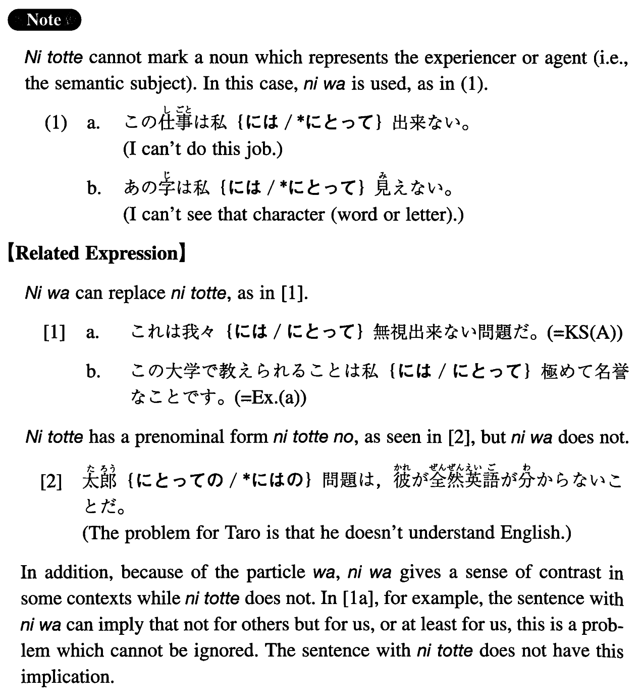

# にとって

 
 
 
 

## Summary

<table><tr>   <td>Summary</td>   <td>From the standpoint of; so far as someone (or something) is concerned.</td></tr><tr>   <td>English</td>   <td>To; for</td></tr><tr>   <td>Part of speech</td>   <td>Compound Particle</td></tr><tr>   <td>Related expression</td>   <td>には</td></tr></table>

## Formation

<table class="table"><tbody><tr class="tr head"><td class="td">Noun</td><td class="td">にとって</td><td class="td"></td></tr><tr class="tr"><td class="td"></td><td class="td">私にとって</td><td class="td">To/for me</td></tr></tbody></table>

## Example Sentences

<table><tr>   <td>これは我々にとって無視出来ない問題だ。</td>   <td>For us this is a problem which cannot be ignored.</td></tr><tr>   <td>この大学で教えられることは私にとって極めて名誉なことです。</td>   <td>Being able to teach at this university is a big honour for me.</td></tr><tr>   <td>町の人々にとってこの工場の閉鎖は死活問題だ。</td>   <td>For people in this town, the shutdown of this plant is a matter of life and death.</td></tr><tr>   <td>今日は私達にとって忘れられない日になるでしょう。</td>   <td>Today will be an unforgettable day for us.</td></tr><tr>   <td>今度のアメリカの輸入政策は日本企業にとって大きな打撃になる。</td>   <td>America's policy on imports this time will be a big blow to Japanese companies.</td></tr><tr>   <td>今回の合併は我が社にとってあまり益はない。</td>   <td>There is little benefit for us (literally: for our company) in this merger.</td></tr><tr>   <td>ここは君にとって一番安全な場所だ。</td>   <td>This is the safest place for you.</td></tr><tr>   <td>今村さんは私にとって遠い親戚に当たる。</td>   <td>Mr. Imamura is a remote relative of mine.</td></tr></table>

## Grammar Book Page

