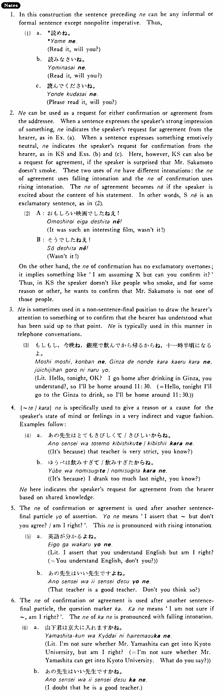

# ね

[1. Summary](#summary) 
[2. Example Sentences](#example-sentences) 
[3. Explanation](#explanation) 
 

## Summary

<table><tr>   <td>Summary</td>   <td>A sentence final particle that indicates the speaker’s request for confirmation or agreement from the hearer about some shared knowledge.</td></tr><tr>   <td>English</td>   <td>English tag question (such as isn’t it?; is it?; don’t you?; do you?); you know</td></tr><tr>   <td>Part of speech</td>   <td>Particle</td></tr></table>

## Example Sentences

<table><tr>   <td>坂本さんは煙草を吸わない・吸いませんね。</td>   <td>Mr. Sakamoto doesn't smoke, does he? / Mr. Sakamoto, you don't &nbsp;smoke, do you?</td></tr><tr>   <td>A:今日はいい天気ですね。B:本当にそうですね。</td>   <td>A: Today is a fine day, isn't it? &nbsp; B: Isn't it!</td></tr><tr>   <td>あなたは学生ですね。</td>   <td>You are a student, aren't you?</td></tr><tr>   <td>パーティーにいらっしゃいますね。</td>   <td>You are going to the party, aren't you?</td></tr></table>

## Explanation

1. In this construction the sentence preceding ね can be any informal or formal sentence except nonpolite imperative. Thus,
  <ul>(1) <li>a. *読めね。</li> <li>Read it, will you?</li> 

 <li>b. 読みなさいね。 </li> <li>Read it, will you?</li> 

 <li>c. 読んでくださいね。</li> <li>Please read it, will you?</li> </ul>  
2. ね can be used as a request for either confirmation or agreement from the addressee. When a sentence expresses the speaker's strong impression of something, ね indicates the speakers request for agreement from the hearer, as in Example (a). When a sentence expresses something emotively neutral, ね indicates the speaker's request for confirmation from the hearer, as in Key Sentence and Examples (b) and (c). Here, however, Key Sentence can also be a request for agreement, if the speaker is surprised that Mr. Sakamoto doesn't smoke. These two uses of ね have diflferent intonations: the ね of agreement uses falling intonation and the ね of confirmation uses rising intonation. The ね of agreement becomes ねえ if the speaker is excited about the content of his statement. In other words, Sentenceねえ is an exclamatory sentence, as in (2).
  <ul>(2) <li>A: 面白い映画でしたねえ！</li> <li>It was such an interesting film, wasn't it!</li> 

 <li>B:そうでしたねえ！</li> <li>Wasn't it!</li> </ul>  
On the other hand, the ね of confirmation has no exclamatory overtones; it implies something like 'I am assuming X but can you confirm it?' Thus, in Key Sentence the speaker doesn't like people who smoke, and for some reason or other, he wants to confirm that Mr. Sakamoto is not one of those people.
  
3. ね is sometimes used in a non-sentence-final position to draw the hearer's attention to something or to confirm that the hearer has understood what has been said up to that point. ね is typically used in this manner in telephone conversations.
  <ul>(3) <li>もしもし、今晩ね、銀座で飲んでから帰るからね、十一時半頃になるよ。</li> <li>Literally: Hello, tonight, OK? I go home after drinking in Ginza, you understand?, so I'll be home around 11:30. </li> <li>= Hello, tonight I'll go to Ginza to drink, so I'll be home around 11:30.</li> </ul>  
4. {て/から}ね is specifically used to give a reason or a cause for the speaker's state of mind or feelings in a very indirect and vague fashion. Examples follow:
  <ul>(4) <li>a. あの先生はとてもきびしくて/きびしいからね。</li> <li>(It's because) that teacher is very strict, you know?</li> 

 <li>b. ゆうべは飲みすぎて/飲みすぎたからね。</li> <li>(It's because) I drank too much last night, you know?</li> </ul>  
ね here indicates the speaker's request for agreement from the hearer based on shared knowledge.
  
5. The ね of confirmation or agreement is used after another sentence-final particle よ of assertion. よね means 'I assert that ~ but don't you agree?/am I right?'. This ね is pronounced with rising intonation
  <ul>(5) <li>a. 英語が分かるよね。</li> <li>Literally: I assert that you understand English but am I right? (= You understand English, don't you?)</li> 

 <li>b. あの先生はいい先生ですよね。</li> <li>That teacher is a good teacher. Don't you think so?</li> </ul>  
6. The ね of confirmation or agreement is used after another sentence-final particle, the question marker か. かね means 'I am not sure if ~, am I right?'. The ね of かね is pronounced with falling intonation.
  <ul>(6) <li>a. 山下君は京大に入れますかね。</li> <li>Literally: I'm not sure whether Mr. Yamashita can get into Kyoto University, but am I right? </li> <li>= I'm not sure whether Mr. Yamashita can get into Kyoto University. What do you say?</li> 

 <li>b. あの先生はいい先生ですかね。</li> <li>I doubt that he is a good teacher.</li> </ul>

## Grammar Book Page

