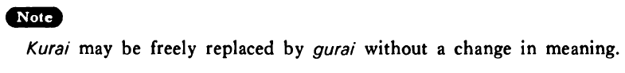

# くらい

 
 
 
 
 

## Summary

<table><tr>   <td>Summary</td>   <td>Approximate quantity or extent.</td></tr><tr>   <td>English</td>   <td>Approximately; about</td></tr><tr>   <td>Part of speech</td>   <td>Particle</td></tr><tr>   <td>Related expression</td>   <td>ごろ; ほど; (ばかり)</td></tr></table>

## Formation

<table class="table"> <tbody><tr class="tr head"> <td class="td">(i)  Number-counter</td> <td class="td">くらい </td> <td class="td">&nbsp;</td> </tr> <tr class="tr"> <td class="td">&nbsp;</td> <td class="td">四冊くらい </td> <td class="td">About    four volumes</td> </tr> <tr class="tr"> <td class="td">&nbsp;</td> <td class="td">百人くらい </td> <td class="td">About    a hundred people</td> </tr> <tr class="tr head"> <td class="td">(ii)  Demonstrateive {pronoun/adjective}</td> <td class="td">&nbsp;</td> <td class="td">&nbsp;</td> </tr> <tr class="tr"> <td class="td">&nbsp;</td> <td class="td">{これ /この} くらい</td> <td class="td">About    this much/to about this extent</td> </tr> <tr class="tr"> <td class="td">&nbsp;</td> <td class="td">{それ /その} くらい</td> <td class="td">About    that much/to about that extent</td> </tr> <tr class="tr"> <td class="td">&nbsp;</td> <td class="td">{あれ /あの} くらい</td> <td class="td">(Referring    to an object that is removed from both the speaker and the hearer) about that    much/to about that extent</td> </tr> <tr class="tr"> <td class="td">&nbsp;</td> <td class="td">{どれ /どの} くらい</td> <td class="td">About    how much?/to about what extent?</td> </tr> <tr class="tr head"> <td class="td">(iii)  Interrogative pronoun</td> <td class="td">いくらくらい </td> <td class="td">About    how much?</td> </tr></tbody></table>

## Example Sentences

<table><tr>   <td>東京からサンフランシスコまで飛行機で九時間くらいかかる・かかります。</td>   <td>It's about nine hours by plane from Tokyo to San Francisco.</td></tr><tr>   <td>A:その車はいくらぐらいでしたか。  B:百五十万円くらいでした。</td>   <td>A: About how much was that car?&emsp;&emsp;B: It was about 1,500,000 yen.</td></tr><tr>   <td>スミスさんは京都に四ヶ月くらい行っていました。</td>   <td>Mr. Smith was in Kyoto for about four months.</td></tr><tr>   <td>山田ぐらい英語が出来れば楽しいでしょうね。</td>   <td>It must be fun to be able to speak English as well as Mr. Yamada (literally: to the extent of Mr. Yamada).</td></tr><tr>   <td>私だってそれぐらいのことは分かりますよ。</td>   <td>Even I can understand that sort of thing (literally: things of that extent).</td></tr></table>

## Explanation

くらい may be freely replaced by ぐらい without a change in meaning.

## Grammar Book Page

