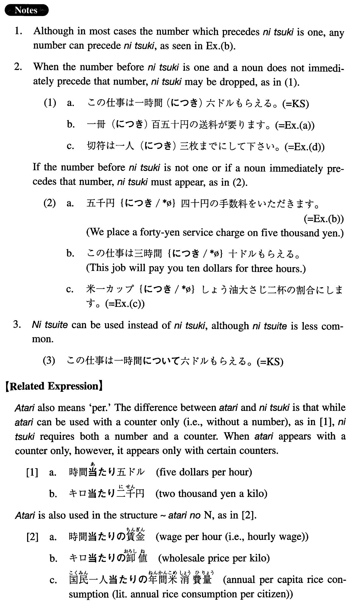

# につき

[1. Summary](#summary) 
[2. Formation](#formation) 
[3. Example Sentences](#example-sentences) 
 

## Summary

<table><tr>   <td>Summary</td>   <td>A compound particle which expresses a rate or ratio.</td></tr><tr>   <td>English</td>   <td>A; per; for; on; to</td></tr><tr>   <td>Part of speech</td>   <td>Compound Particle</td></tr><tr>   <td>Related expression</td>   <td>あたり</td></tr></table>

## Formation

<table class="table"><tbody><tr class="tr head"><td class="td">Number+Counter</td><td class="td">につき</td><td class="td"></td></tr><tr class="tr"><td class="td"></td><td class="td">一時間につき</td><td class="td">Per hour</td></tr></tbody></table>

## Example Sentences

<table><tr>   <td>この仕事は一時間につき六ドル貰える。</td>   <td>This job will pay you six dollars an hour. (literally: You can get six dollars an hour doing this job.)</td></tr><tr>   <td>一冊につき百五十円の送料が要ります。</td>   <td>A hundred and fifty yen is necessary per copy for postage. (literally: Postage of one hundred and fifty yen is necessary per copy.)</td></tr><tr>   <td>五千円につき四十円の手数料をいただきます。</td>   <td>We place a forty-yen service charge on five thousand yen</td></tr><tr>   <td>米一カップにつき、しょう油大さじ二杯の割合にします。</td>   <td>The ratio should be two tablespoons of soy sauce to a cup of rice.</td></tr><tr>   <td>切符は一人につき三枚までにして下さい。</td>   <td>Please limit it to three tickets per person.</td></tr><tr>   <td>間違い一つにつき一点減点します。</td>   <td>I'll take one point off for each mistake.</td></tr></table>

## Grammar Book Page

