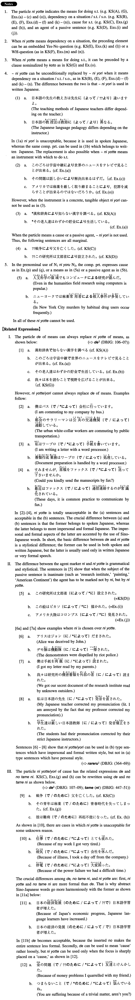

# によって/より

[1. Summary](#summary) 
[2. Formation](#formation) 
[3. Example Sentences](#example-sentences) 
[4. Grammar Book Page](#grammar-book-page) 

## Summary

<table><tr>   <td>Summary</td>   <td>A particle that indicates means, cause, agent of passive sentence, or dependency on a situation.</td></tr><tr>   <td>Equivalent</td>   <td>According to; due to; owing to; because of; depending on; from ~ to; by means of; on the basis of; with; by</td></tr><tr>   <td>Part of speech</td>   <td>Compound Particle</td></tr><tr>   <td>Related expression</td>   <td>に; で; の為に</td></tr></table>

## Formation

<table class="table"><tbody><tr class="tr head"><td class="td">(i) Noun</td><td class="td">によって</td><td class="td"></td></tr><tr class="tr"><td class="td"></td><td class="td">政府によって</td><td class="td">By the government</td></tr><tr class="tr head"><td class="td">(ii) {V/Adjective い}informal</td><td class="td">かどうかに{よって/より}</td><td class="td"></td></tr><tr class="tr"><td class="td"></td><td class="td">{来る/来た}かどうかに{よって/より}</td><td class="td">Depending on whether someone comes/came or not</td></tr><tr class="tr"><td class="td"></td><td class="td">{面白い/面白かった}かどうかに{よって/より}</td><td class="td">Depending on whether something is/was interesting or not</td></tr><tr class="tr head"><td class="td">(iii) {Adjective な stem/Noun}</td><td class="td">{Ø/だった}かどうかに{よって/より}</td><td class="td"></td></tr><tr class="tr"><td class="td"></td><td class="td">{静か/静かだった}かどうかに{よって/より}</td><td class="td">Depending on whether something is/was quiet or not</td></tr><tr class="tr head"><td class="td">(iv) Embedded Wh-Question</td><td class="td">に{よって/より}</td><td class="td"></td></tr><tr class="tr"><td class="td"></td><td class="td">何を食べたかに{よって/より}</td><td class="td">Depending on what someone ate</td></tr><tr class="tr"><td class="td"></td><td class="td">誰が来るかに{よって/より}</td><td class="td">Depending on who comes</td></tr></tbody></table>

## Example Sentences

<table><tr>   <td>漢和辞典によって知らない漢字を調べる。</td>   <td>We examine unknown kanji with a Chinese character dictionary.</td></tr><tr>   <td>先生によって、勿論、教え方が違います。</td>   <td>Teaching methods are, of course, different, depending on the teacher.</td></tr><tr>   <td>戦争によって父を亡くした。</td>   <td>We lost our father, owing to the war.</td></tr><tr>   <td>この研究所は文部省によって設立された。</td>   <td>This research institute was established by the Ministry of Education.</td></tr><tr>   <td>奨学金がもらえるかどうかによって大学入学を決めます。</td>   <td>I will decide my entrance to college, depending on whether I can get a scholarship or not.</td></tr><tr>   <td>何を食べるかによって健康状態は変わる。</td>   <td>Our health condition changes according to what we eat.</td></tr><tr>   <td>我々は本を読むことによって視野を広げることが出来る。</td>   <td>We can expand our horizons by reading books.</td></tr><tr>   <td>この頃は宇宙中継によって世界のニュースをテレビで見ることが出来る。</td>   <td>These days we can watch world news on TV via satellite live broadcasting.</td></tr><tr>   <td>その老人達はわずかの貯金によって生活している。</td>   <td>The old people are living on little savings.</td></tr><tr>   <td>その問題は話し合いによって解決出来るはずだ。</td>   <td>We should be able to solve that problem by means of negotiation.</td></tr><tr>   <td>人によって、年のとり方が違う。</td>   <td>Depending on the person, the aging process differs.</td></tr><tr>   <td>僕はその日の気分によって、違う音楽を聞きます。</td>   <td>Depending on the day's mood, I listen to different music.</td></tr><tr>   <td>定年は会社によって違う。</td>   <td>Retirement ages vary from company to company.</td></tr><tr>   <td>その青年は麻薬によって青春時代を失ってしまった。</td>   <td>The young man lost his adolescence because of drugs.</td></tr><tr>   <td>彼は難病によって再起不能になった。</td>   <td>He became unable to come back because of the difficult disease.</td></tr><tr>   <td>この絵はピカソによって描かれた。</td>   <td>This picture was painted by Picasso.</td></tr></table>

## Grammar Book Page

