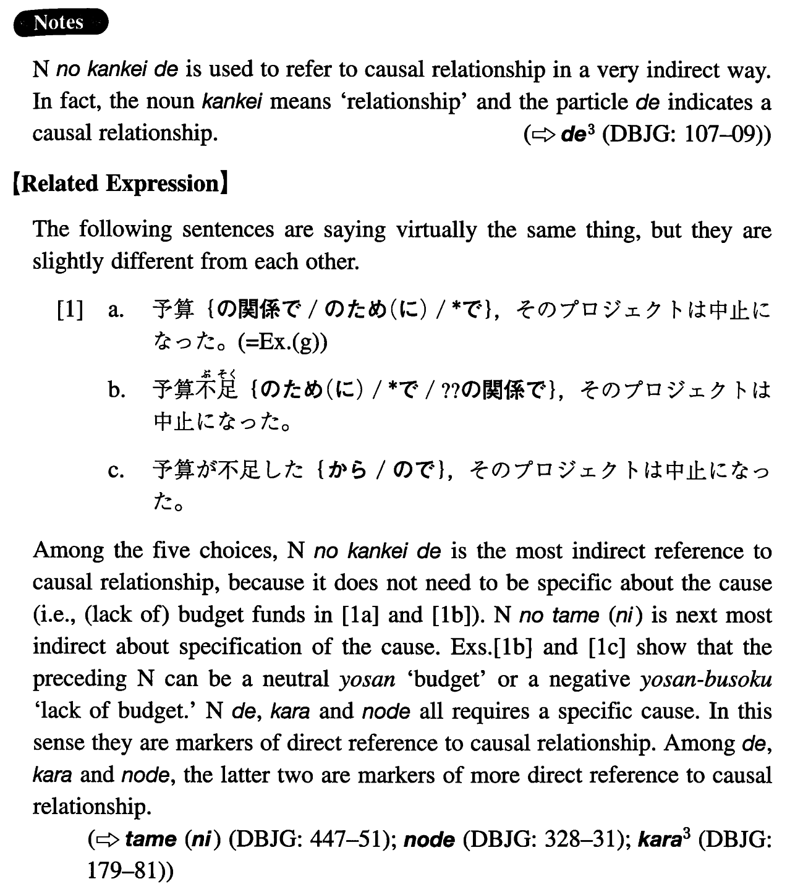

# の関係で

[1. Summary](#summary) 
[2. Formation](#formation) 
[3. Example Sentences](#example-sentences) 
[4. Grammar Book Page](#grammar-book-page) 

## Summary

<table><tr>   <td>Summary</td>   <td>A phrase indicating that something takes place or does not take place because of something.</td></tr><tr>   <td>English</td>   <td>Because of</td></tr><tr>   <td>Part of speech</td>   <td>Phrase</td></tr><tr>   <td>Related expression</td>   <td>の為(に)</td></tr></table>

## Formation

<table class="table"><tbody><tr class="tr head"><td class="td">Noun</td><td class="td">の関係で</td><td class="td"></td></tr><tr class="tr"><td class="td"></td><td class="td">会社の関係で</td><td class="td">Because of the company</td></tr><tr class="tr"><td class="td"></td><td class="td">天気の関係で</td><td class="td">Because of the weather</td></tr></tbody></table>

## Example Sentences

<table><tr>   <td>ホールさんは今仕事の関係で東京に行っています。</td>   <td>Mr. Hall has gone to Tokyo on a business-related matter.</td></tr><tr>   <td>鈴木は単位の関係で今年は卒業出来ないそうだ。</td>   <td>I heard that Suzuki cannot graduate this year because of insufficient credits / units.</td></tr><tr>   <td>時間の関係で、残念ですが、詳しくお話し出来ません。</td>   <td>Because of the time limit, I am sorry I cannot go into detail.</td></tr><tr>   <td>部屋の広さの関係で、四十人以上はお呼び出来ません。</td>   <td>Because of the size of the room we cannot invite more than 40 people.</td></tr><tr>   <td>桃子は年齢の関係で、採用されなかったようだ。</td>   <td>It seems that Momoko was not hired because of her age.</td></tr><tr>   <td>レズリーは会社の関係でよく海外に出張するらしい。</td>   <td>I was told that Leslie makes frequent company-related business trips abroad (literally: makes frequent trips abroad because of his company).</td></tr><tr>   <td>みゆきは御主人の仕事の関係でロンドンに三年住むそうだ。</td>   <td>I heard that because of her husband's work Miyuki is going to live in London for 3 years.</td></tr><tr>   <td>予算の関係で、そのプロジェクトは中止になった。</td>   <td>Because of the budgetary situation, the project has been cancelled.</td></tr></table>

## Grammar Book Page

