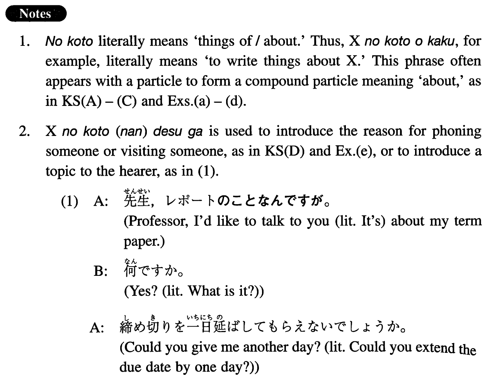

# のこと

[1. Summary](#summary) 
[2. Formation](#formation) 
[3. Example Sentences](#example-sentences) 
[4. Grammar Book Page](#grammar-book-page) 

## Summary

<table><tr>   <td>Summary</td>   <td>Things of/about.</td></tr><tr>   <td>English</td>   <td>About; in terms of; related to</td></tr><tr>   <td>Part of speech</td>   <td>Phrase</td></tr><tr>   <td>Related expression</td>   <td>に関して/関する; について</td></tr></table>

## Formation

<table class="table"><tbody><tr class="tr head"><td class="td">Noun</td><td class="td">のこと</td><td class="td"></td></tr><tr class="tr"><td class="td"></td><td class="td">試験のこと</td><td class="td">About an/the exam</td></tr></tbody></table>

## Example Sentences

<table><tr>   <td>私は明日の講義で日本文化のことを話すつもりだ。</td>   <td>I'm going to talk about Japanese culture in my lecture tomorrow.</td></tr><tr>   <td>彼女のことはもう忘れた方がいいよ。</td>   <td>You'd better forget about her now.</td></tr><tr>   <td>日本留学のことでちょっとご相談があるんですが。</td>   <td>I'd like to talk to you about studying in Japan.</td></tr><tr>   <td>実は、明日の会議のことなんですが。</td>   <td>Actually, it's (=the reason I'm calling is /the reason I came to see you is) about tomorrow's meeting.</td></tr><tr>   <td>昨日荒井さんが君のことを色々聞いていたよ。</td>   <td>Miss Arai asked various questions about you yesterday.</td></tr><tr>   <td>レポートは日本の大学生活のことを書こうと思っている。</td>   <td>For my term paper I'm thinking of writing about college life in Japan.</td></tr><tr>   <td>子供のことは私が責任を持ちます。</td>   <td>I'll take the responsibility for our children (literally: for things related to our children).</td></tr><tr>   <td>今回の実習のことでは大変お世話になりました。</td>   <td>I owe you a lot in terms of my internship this time.</td></tr><tr>   <td>あのう、お電話したのは、来週のパーティーのことなんですが。</td>   <td>(The reason) I'm calling (is to talk) about the party next week.</td></tr></table>

## Grammar Book Page

