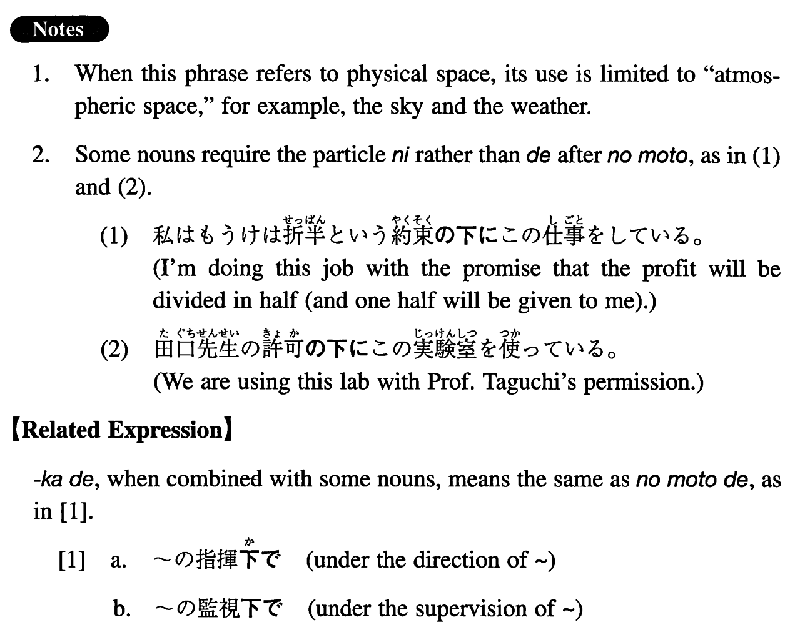

# の下で

 
 
 
 

## Summary

<table><tr>   <td>Summary</td>   <td>Under some object; under the control or influence of someone or something.</td></tr><tr>   <td>English</td>   <td>Under; in; with</td></tr><tr>   <td>Part of speech</td>   <td>Compound Particle (used in writing and formal speech only)</td></tr><tr>   <td>Related expression</td>   <td>かで</td></tr></table>

## Formation

<table class="table"><tbody><tr class="tr head"><td class="td">Noun</td><td class="td">の下で</td><td class="td"></td></tr><tr class="tr"><td class="td"></td><td class="td">学部長の指揮の下で</td><td class="td">Under the direction of the dean</td></tr></tbody></table>

## Example Sentences

<table><tr>   <td>私は鈴木先生の指導の下で修士論文を書き上げた。</td>   <td>I finished my master's thesis under Professor Suzuki's guidance.</td></tr><tr>   <td>さんさんたる太陽の下で開会式が行われた。</td>   <td>The opening ceremony was held in (literally: under) the brilliant sun.</td></tr><tr>   <td>彼はカラヤンの下で指導法を学んだ。</td>   <td>He studied conducting under (Herbert von) Karajan.</td></tr><tr>   <td>弁護士（の）立ち会いの下で私達の離婚が成立した。</td>   <td>Our divorce was agreed upon in (literally: under) the presence of attorneys.</td></tr><tr>   <td>囚人達は厳しい監視の下で強制労働をさせられた。</td>   <td>The prisoners were forced to work under strict supervision.</td></tr><tr>   <td>このインフレの下では金を貯めても意味がない。</td>   <td>With this inflation there's no point in saving money.</td></tr></table>

## Grammar Book Page

