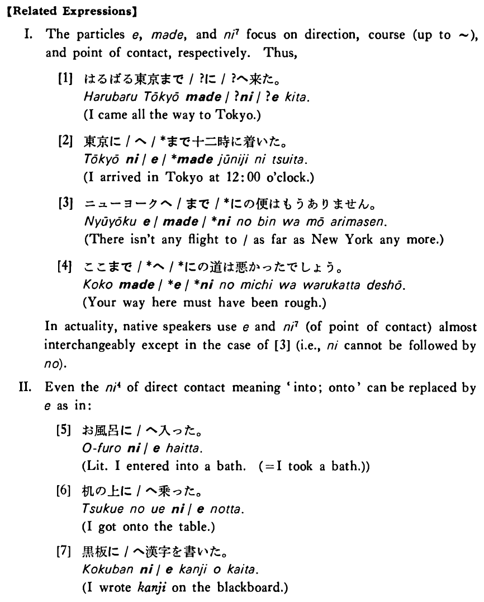

# へ

[1. Summary](#summary) 
[2. Example Sentences](#example-sentences) 
[3. Explanation](#explanation) 
 

## Summary

<table><tr>   <td>Summary</td>   <td>A particle that indicates the direction toward which some directional movement or action proceeds.</td></tr><tr>   <td>English</td>   <td>To; towards</td></tr><tr>   <td>Part of speech</td>   <td>Particle</td></tr><tr>   <td>Related expression</td>   <td>まで; に4; に7</td></tr></table>

## Example Sentences

<table><tr>   <td>私は先週京都へ旅行に行った・行きました。</td>   <td>I went on a trip to Kyoto last week.</td></tr><tr>   <td>私は札幌のうちへ飛行機で帰った。</td>   <td>I went back home to Sapporo by plane.</td></tr><tr>   <td>地震だったのでいそいで外へ出た。</td>   <td>It was an earthquake, so I went outside quickly.</td></tr><tr>   <td>父へ手紙を出したが、まだ返事が来ない。</td>   <td>I sent a letter to my father, but his reply has not come yet.</td></tr></table>

## Explanation

【Related Expressions】
  
I. The particles へ, まで, and に7 focus on direction, course (up to ~), and point of contact, respectively. Thus,
  
[1]
  <ul> <li>はるばる東京まで/?に/?へ来た。</li> <li>I came all the way to Tokyo.</li> </ul>  
[2]
  <ul> <li>東京に/へ/*まで十二時に着いた。</li> <li>I arrived in Tokyo at 12:00 o'clock.</li> </ul>  
[3]
  <ul> <li>ニューヨークへ/まで/*にの便はもうありません。</li> <li>There isn't any flight to/as far as New York any more.</li> </ul>  
[4]
  <ul> <li>ここまで/*へ/*にの道は悪かったでしょう。</li> <li>Your way here must have been rough.</li> </ul>  
In actuality, native speakers use へ and に7 (of point of contact) almost interchangeably except in the case of [3] (i.e., に cannot be followed by の).
  
II. Even the に4 of direct contact meaning 'into; onto' can be replaced by へ as in:
  
[5]
  <ul> <li>お風呂に/へ入った。</li> <li>Literally: I entered into a bath. (= I took a bath.)</li> </ul>  
[6]
  <ul> <li>机の上に/へ乗った。</li> <li>I got onto the table.</li> </ul>  
[7]
  <ul> <li>黒板に/へ漢字を書いた。</li> <li>I wrote kanji on the blackboard.</li> </ul>

## Grammar Book Page

