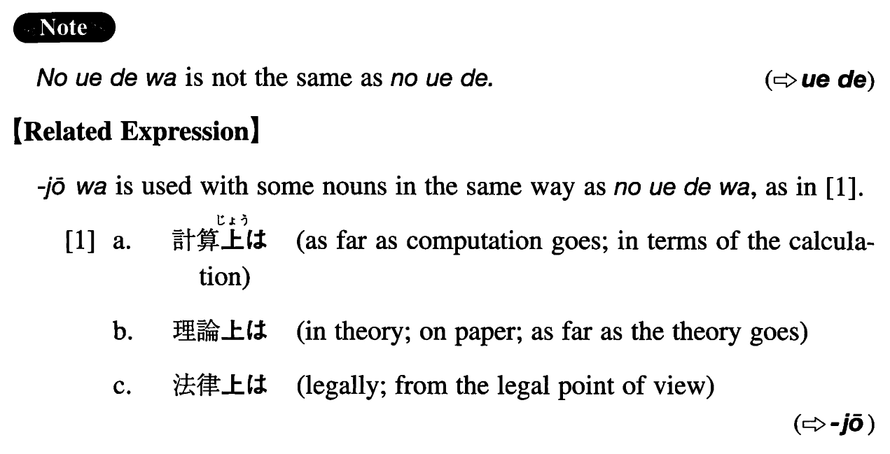

# の上では

[1. Summary](#summary) 
[2. Formation](#formation) 
[3. Example Sentences](#example-sentences) 
[4. Grammar Book Page](#grammar-book-page) 

## Summary

<table><tr>   <td>Summary</td>   <td>As far as ~ is concerned.</td></tr><tr>   <td>Equivalent</td>   <td>As far as ~ is concerned; as far as ~ goes; from the viewpoint/standpoint of; according to; in terms of</td></tr><tr>   <td>Part of speech</td>   <td>Compound Particle</td></tr><tr>   <td>Related expression</td>   <td>じょうは</td></tr></table>

## Formation

<table class="table"><tbody><tr class="tr head"><td class="td">Noun</td><td class="td">の上では</td><td class="td"></td></tr><tr class="tr"><td class="td"></td><td class="td">理論の上では</td><td class="td">In theory; on paper; as far as the theory goes</td></tr></tbody></table>

## Example Sentences

<table><tr>   <td>この計画は書類の上では問題なさそうだ。</td>   <td>There seems to be no problem with this plan as far as the documents are concerned.</td></tr><tr>   <td>計算の上では二百万円ぐらい儲かることになっている。</td>   <td>According to the calculations, we are supposed to make a profit of (about) two million yen.</td></tr><tr>   <td>このプロジェクトは話しの上ではうまく行きそうだが、何となく不安だ。</td>   <td>Although in theory (literally: As far as the story is concerned,) it looks like this project will work out, I feel somewhat uneasy</td></tr><tr>   <td>数字の上では川野の方が倉田より強そうだ。</td>   <td>Statistically, (literally: As far as the figures are concerned,) Kawano looks stronger than Kurata.</td></tr><tr>   <td>大野は仕事の上では完全主義者だが、私生活はだらしがない。</td>   <td>Ohno is a perfectionist at work (literally: as far as his business is concerned) but messy in his private life.</td></tr><tr>   <td>彼の行為は法律の上では罰しようがない。</td>   <td>There's no way to punish his conduct legally (literally: from the legal point of view).</td></tr></table>

## Grammar Book Page

