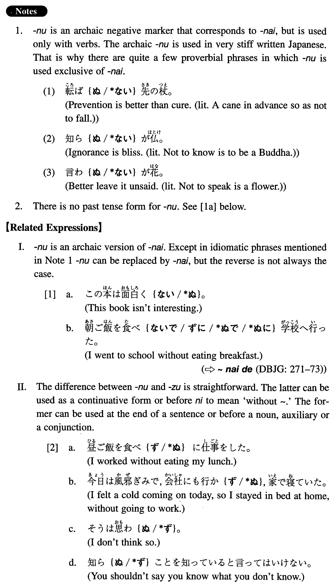

# ぬ

 
 
 
 

## Summary

<table><tr>   <td>Summary</td>   <td>An archaic auxiliary that indicates negation.</td></tr><tr>   <td>English</td>   <td>Not</td></tr><tr>   <td>Part of speech</td>   <td>Auxiliary (used in writing and formal speech only)</td></tr><tr>   <td>Related expression</td>   <td>ない; ず</td></tr></table>

## Formation

<table class="table"><tbody><tr class="tr head"><td class="td">Vnegative</td><td class="td">ぬ (Noun/Auxillary) </td><td class="td"></td></tr><tr class="tr"><td class="td"></td><td class="td">知らぬ</td><td class="td">Someone doesn’t know someone/something</td></tr><tr class="tr"><td class="td"></td><td class="td">知らぬ人</td><td class="td">A person whom someone doesn’t know or someone who doesn’t know something</td></tr><tr class="tr"><td class="td"></td><td class="td">知らぬらしい</td><td class="td">It appears that someone doesn’t know someone/something</td></tr><tr class="tr head"><td class="td">Irregular</td><td class="td">せぬ</td><td class="td">Does not do something</td></tr><tr class="tr head"><td class="td">Irregular</td><td class="td">おらぬ</td><td class="td">Someone does not exist</td></tr></tbody></table>

## Example Sentences

<table><tr>   <td>グローバルな時代に自国のことだけを考えるわけにはいかぬ。</td>   <td>In the global age we cannot think of our own country alone.</td></tr><tr>   <td>知らぬことを知らぬと言うには勇気が要る。</td>   <td>When you don't know something, it takes courage to admit it.</td></tr><tr>   <td>彼は何を聞いても、知らぬとしか答えぬ。</td>   <td>No matter what I ask, he answers only that he does not know.</td></tr><tr>   <td>その日本人は英語が分からぬようだった。</td>   <td>That Japanese did not seem to understand English.</td></tr><tr>   <td>最近は滅多に酒を飲まぬが、若い頃はよく飲んだものだ。</td>   <td>I seldom drink these days, but I used to drink a lot when I was young.</td></tr><tr>   <td>日本語が話せる者はこの辺にはおらぬ。</td>   <td>In this area there are not people who can speak Japanese.</td></tr></table>

## Grammar Book Page

