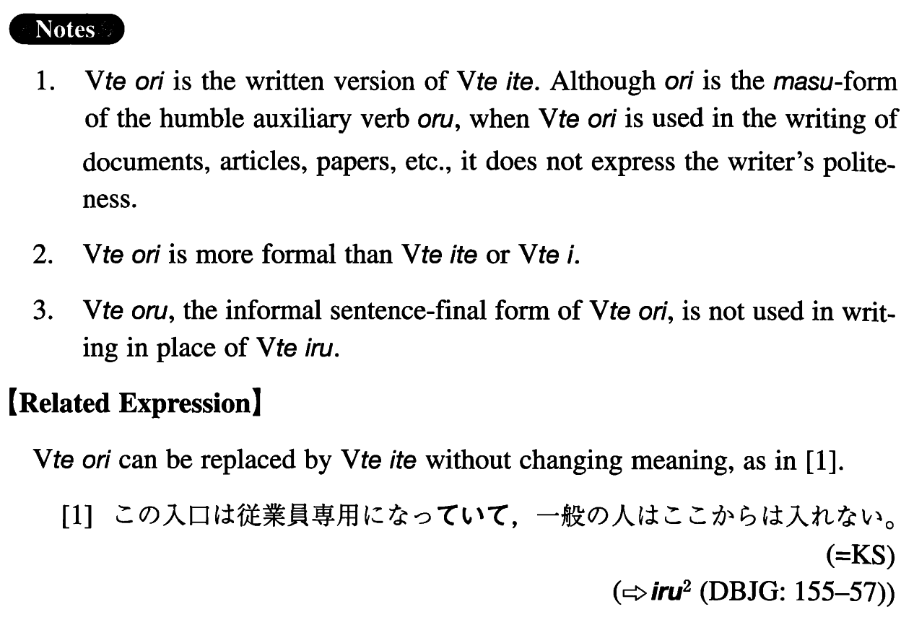

# おり

 
 
 
 

## Summary

<table><tr>   <td>Summary</td>   <td>Vます of the auxiliary verb おる.</td></tr><tr>   <td>English</td>   <td>Be ~ and</td></tr><tr>   <td>Part of speech</td>   <td>Auxiliary Verb (Group 1) (used in writing and formal speech only)</td></tr><tr>   <td>Related expression</td>   <td>いて</td></tr></table>

## Formation

<table class="table"><tbody><tr class="tr head"><td class="td">Vて</td><td class="td">おり</td><td class="td"></td></tr><tr class="tr"><td class="td"></td><td class="td">話しており</td><td class="td">Be speaking and</td></tr></tbody></table>

## Example Sentences

<table><tr>   <td>この入口は従業員専用になっており、一般の人はここからは入れない。</td>   <td>This entrance is for employees only and other people (literally: general people) cannot enter from here.</td></tr><tr>   <td>彼は最近プラモデルに凝っており、暇さえあれば模型の飛行機に組み立てている。</td>   <td>He is crazy about plastic models these days and is assembling model planes whenever he has free time.</td></tr><tr>   <td>日本では義務教育がよく行き届いており、識字率はほとんど１００パーセントに近い。</td>   <td>In Japan compulsory education is very thorough (literally: prevails thoroughly) and the literacy rate is almost 100 percent.</td></tr><tr>   <td>この高校は全寮制になっており、全学生が三つの寮で生活している。</td>   <td>This high school is a boarding school (literally: total dormitory system) and all the students live in three dormitories</td></tr></table>

## Grammar Book Page

