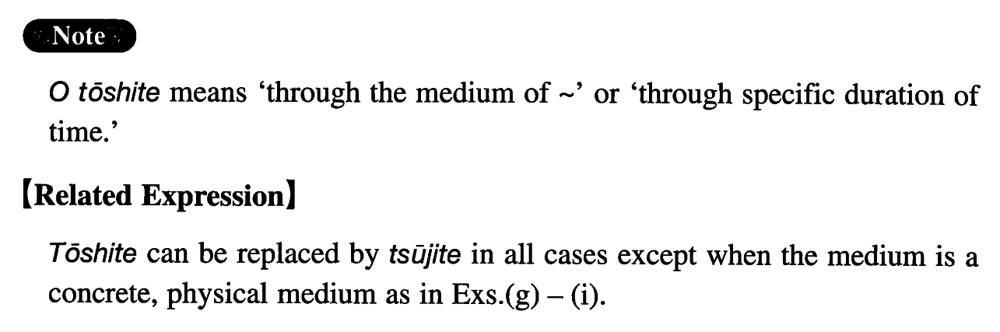

# を通して

[1. Summary](#summary) 
[2. Formation](#formation) 
[3. Example Sentences](#example-sentences) 
[4. Grammar Book Page](#grammar-book-page) 

## Summary

<table><tr>   <td>Summary</td>   <td>A compound particle that is used to indicate a medium through which something is done or time through which something takes place.</td></tr><tr>   <td>Equivalent</td>   <td>Through; by the medium of; via; throughout</td></tr><tr>   <td>Part of speech</td>   <td>Compound Particle</td></tr><tr>   <td>Related expression</td>   <td>を通じて</td></tr></table>

## Formation

<table class="table"><tbody><tr class="tr head"><td class="td">Noun</td><td class="td">を通して</td><td class="td"></td></tr><tr class="tr"><td class="td"></td><td class="td">先生を通して</td><td class="td">Through my teacher</td></tr></tbody></table>

## Example Sentences

<table><tr>   <td>私は親しい友達を通してそのピアニストと知り合いになった。</td>   <td>I became acquainted with the pianist through a close friend of mine.</td></tr><tr>   <td>私は一年を通して五回ぐらい海外に行っている。</td>   <td>I go abroad about 5 times a year (literally: throughout the year).</td></tr><tr>   <td>お書きになった御本を通して、先生のことは存じ上げておりました。</td>   <td>I knew of you through the books you wrote.</td></tr><tr>   <td>その事件のことは新聞の記事を通して知っていた。</td>   <td>I knew about the incident from newspaper articles.</td></tr><tr>   <td>その政治家は、首相の側近を通して、首相に接近した。</td>   <td>That politician approached the Prime Minister through his entourage.</td></tr><tr>   <td>二人は手紙のやり取りを通して親しくなっていった。</td>   <td>Through an exchange of letters, the two became close.</td></tr><tr>   <td>ラジオもテレビも全国の放送網を通して放送される。</td>   <td>Both radio and television programs are broadcast through the nationwide network.</td></tr><tr>   <td>海外生活の経験を通して色々なことを学んだ。</td>   <td>I have learned all sorts of things through my life in foreign countries.</td></tr><tr>   <td>カーテンを通して室内の様子が見えた。</td>   <td>What was inside the room was visible through the curtain.</td></tr><tr>   <td>これらの写真を通して当時の人々の生活を偲ぶことが出来る。</td>   <td>Through these photos, we can relive the lives of people in those days.</td></tr><tr>   <td>現場に残された指紋を通して犯人が割れた。</td>   <td>They found the criminal through the fingerprints left behind at the scene of the crime.</td></tr><tr>   <td>父は一生を通して、一度も東京を出たことがない。</td>   <td>My father has never left Tokyo in his life.</td></tr></table>

## Grammar Book Page

