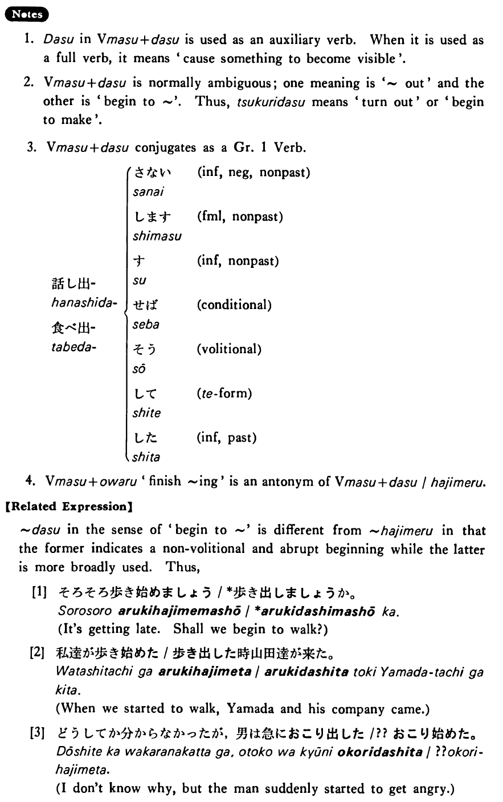

# 出す・だす

[1. Summary](#summary) 
[2. Formation](#formation) 
[3. Example Sentences](#example-sentences) 
[4. Explanation](#explanation) 
[5. Grammar Book Page](#grammar-book-page) 

## Summary

<table><tr>   <td>Summary</td>   <td>Something that has been latent is realised.</td></tr><tr>   <td>Equivalent</td>   <td>Out; begin to; start to</td></tr><tr>   <td>Part of speech</td>   <td>Auxiliary Verb (Group 1)</td></tr><tr>   <td>Related expression</td>   <td>~始める</td></tr><tr>   <td>Antonym expression</td>   <td>~終わる</td></tr></table>

## Formation

<table class="table"><tbody><tr class="tr head"> <td class="td">V ます </td> <td class="td">話し出す </td> <td class="td">Someone    starts to talk</td> </tr> <tr class="tr"> <td class="td">&nbsp;</td> <td class="td">食べ出す </td> <td class="td">Someone starts to eat</td> </tr> </tbody></table>

## Example Sentences

<table><tr>   <td>車が動き出した・出しました。</td>   <td>The car started to move.</td></tr><tr>   <td>急に雨が降り出した。</td>   <td>Suddenly it began to rain.</td></tr><tr>   <td>一歳になって初めて歩き出した。</td>   <td>He started to walk only after he became a year old.</td></tr><tr>   <td>そのアイディアは誰が考え出したんですか。</td>   <td>Who thought out that idea?</td></tr><tr>   <td>一時間ぐらいかけてとうとうその本屋を探し出した。</td>   <td>After spending about an hour, I finally located that bookstore.</td></tr></table>

## Explanation

1. 出す in Verbます+出す is used as an auxiliary verb. When it is used as a full verb, it means 'cause something to become visible'.
  
2. Verbます+出す is normally ambiguous; one meaning is '~ out' and the other is 'begin to ~'. Thus, 作り出す means 'turn out' or 'begin to make'.
  
3. Verbます+出す conjugates as a Group 1 verb.
  <table class="table"> <tbody> <tr class="tr"> <td class="td"></td> <td class="td">⎧なさい</td> <td class="td">informal, negative, nonpast</td> </tr> <tr class="tr"> <td class="td"></td> <td class="td">⎪します</td> <td class="td">formal, nonpast</td> </tr> <tr class="tr"> <td class="td">話し出</td> <td class="td">⎪す</td> <td class="td">informal, nonpast</td> </tr> <tr class="tr"> <td class="td"></td> <td class="td">⎨せば</td> <td class="td">conditional</td> </tr> <tr class="tr"> <td class="td">食べ出</td> <td class="td">⎪そう</td> <td class="td">volitional</td> </tr> <tr class="tr"> <td class="td"></td> <td class="td">⎪して</td> <td class="td">て form</td> </tr> <tr class="tr"> <td class="td"></td> <td class="td">⎩した</td> <td class="td">informal, past</td> </tr> </tbody> </table>  
4. Verbます+終わる 'finish ~ing' is an antonym of Verbます+出す/始める.
  
【Related Expression】
  
出す in the sense of 'begin to ~' is different from 始める in that the former indicates a non-volitional and abrupt beginning while the latter is more broadly used. Thus,
  
[1]
 <ul> <li>そろそろ歩き始めましょう/*歩き出しましょうか。</li> <li>It's getting late. Shall we begin to walk?</li> </ul>  [2]
  <ul> <li>私達が歩き始めた/歩き出した時山田逹が来た。</li> <li>When we started to walk, Yamada and his company came.</li> </ul>  
[3]
  <ul> <li>どうしてか分からなかったが、男は急におこり出した/??おこリ始めた。</li> <li>I don't know why, but the man suddenly started to get angry.</li> </ul>

## Grammar Book Page

