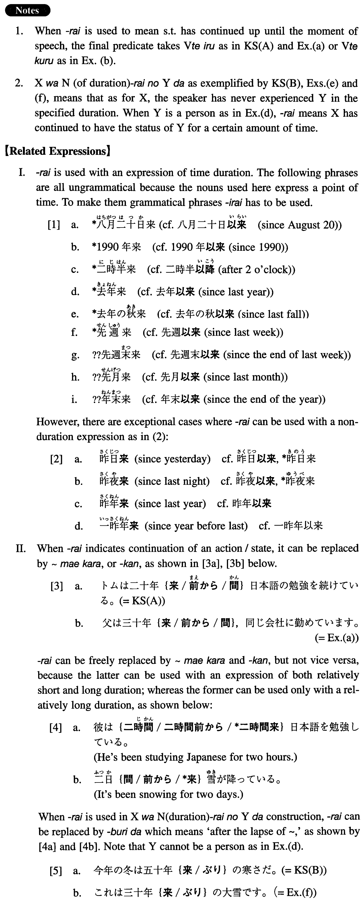

# 来

[1. Summary](#summary) 
[2. Formation](#formation) 
[3. Example Sentences](#example-sentences) 
[4. Grammar Book Page](#grammar-book-page) 

## Summary

<table><tr>   <td>Summary</td>   <td>During a certain amount of time (something has continued up until the moment of speech or something has never been like the current state).</td></tr><tr>   <td>English</td>   <td>For; in; since</td></tr><tr>   <td>Part of speech</td>   <td>Suffix (used in writing and formal speech only)</td></tr><tr>   <td>Related expression</td>   <td>ぶり; 以来; かん; 前から</td></tr></table>

## Formation

<table class="table"><tbody><tr class="tr head"><td class="td">(i) Noun (duration) </td><td class="td">来</td><td class="td"></td></tr><tr class="tr"><td class="td"></td><td class="td">三十年来</td><td class="td">For the past 30 years</td></tr><tr class="tr head"><td class="td">(ii) Noun (duration) </td><td class="td">来</td><td class="td"></td></tr><tr class="tr"><td class="td"></td><td class="td">六十年来の大地震</td><td class="td">The strongest earthquake in 60 years</td></tr></tbody></table>

## Example Sentences

<table><tr>   <td>トムは二十年来日本語の勉強を続けている。</td>   <td>Tom has been studying Japanese for the past 20 years.</td></tr><tr>   <td>今年の冬は五十年来の寒さだ。</td>   <td>This winter is the coldest one in 50 years.</td></tr><tr>   <td>父は三十年来、同じ会社に勤めています。</td>   <td>My father has been employed in the same company for the past 30 years.</td></tr><tr>   <td>私はこの研究を十年来続けてきました。</td>   <td>I've been continuing this research for the past 10 years.</td></tr><tr>   <td>夜半来の雨が、ようやく上がったようだ。</td>   <td>The rain which started after midnight appeared to have finally stopped.</td></tr><tr>   <td>僕と岡田とは四十年来の友人だ。</td>   <td>Okada and I have been friends for the past 40 years.</td></tr><tr>   <td>今年の夏は六十年来の暑さだそうだ。</td>   <td>They say that this summer is the warmest in 60 years.</td></tr><tr>   <td>これは三十年来の大雪です。</td>   <td>This is the heaviest snow we have had in 30 years.</td></tr></table>

## Grammar Book Page

