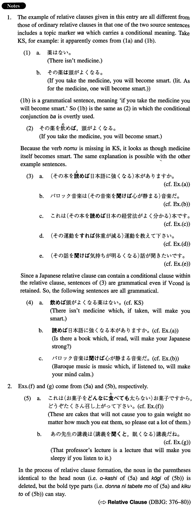

# Relative Clause

 
 
 

## Summary

<table></table>

## Example Sentences

<table><tr>   <td>頭がよくなる薬はない。</td>   <td>There isn't medicine which makes you smart.</td></tr><tr>   <td>日本語に強くなる本がありますか。</td>   <td>Is there a book that will make you strong in Japanese?</td></tr><tr>   <td>バロック音楽は心が静まる音楽だ。</td>   <td>Baroque music is music that soothes the mind.</td></tr><tr>   <td>これは日本の経営法がよく分かる本です。</td>   <td>This is a book which enables us to understand Japanese management.</td></tr><tr>   <td>体重が減る運動を教えて下さい。</td>   <td>Please recommend any exercise that will reduce my weight.</td></tr><tr>   <td>気持ちが明るくなる話が聞きたいです。</td>   <td>I would like to hear something that will cheer me up.</td></tr><tr>   <td>これは太らないお菓子ですから、どうぞ沢山召し上がって下さい。</td>   <td>These are non-fattening cakes, so please eat as much of them as you can.</td></tr><tr>   <td>あの先生の講義はすぐ眠くなる講義だね。</td>   <td>That professor's lecture is a lecture that will make you sleepy.</td></tr></table>

## Grammar Book Page

