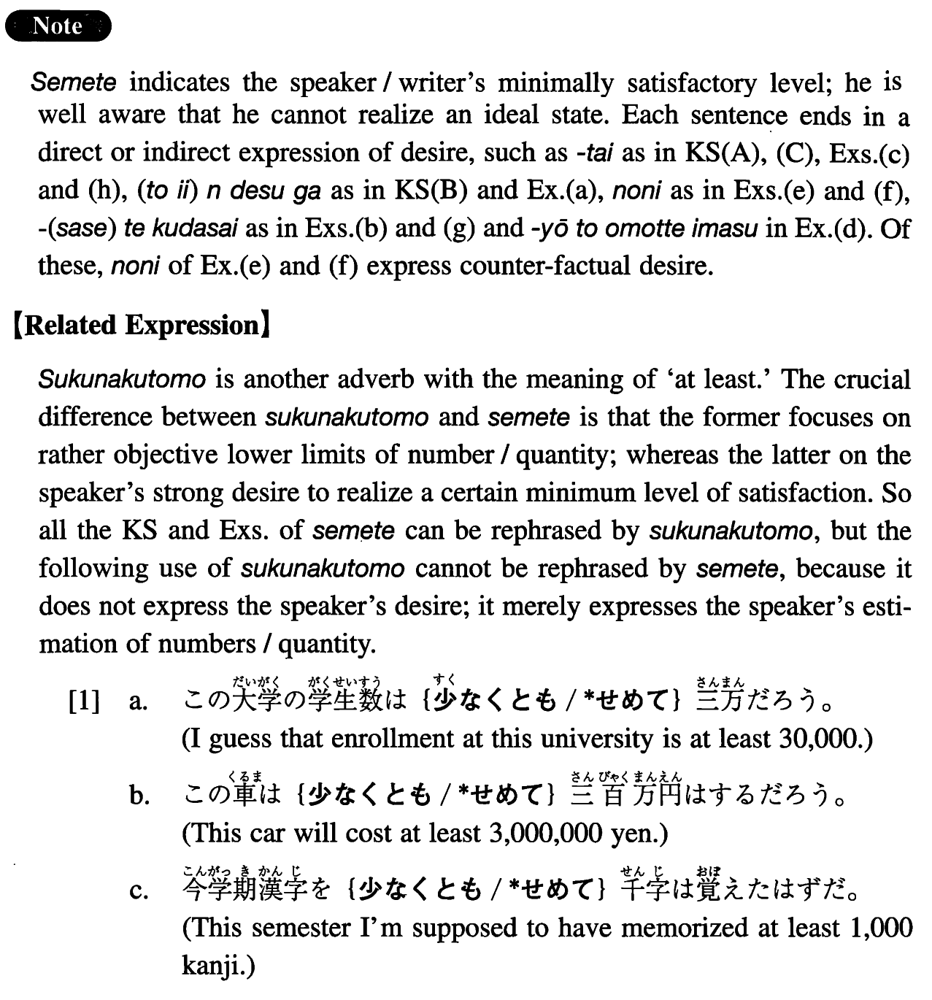

# せめて

[1. Summary](#summary) 
[2. Formation](#formation) 
[3. Example Sentences](#example-sentences) 
[4. Grammar Book Page](#grammar-book-page) 

## Summary

<table><tr>   <td>Summary</td>   <td>An adverb that indicates the speaker/writer's minimally satisfactory level.</td></tr><tr>   <td>English</td>   <td>At least</td></tr><tr>   <td>Part of speech</td>   <td>Adverb</td></tr><tr>   <td>Related expression</td>   <td>少なくとも</td></tr></table>

## Formation

<table class="table"><tbody><tr class="tr head"><td class="td">(i) せめて</td><td class="td">Number+Counter (ぐらい)~</td><td class="td"></td></tr><tr class="tr"><td class="td"></td><td class="td">せめて二時間ぐらい</td><td class="td">At least two hours</td></tr><tr class="tr head"><td class="td">(ii) せめて</td><td class="td">Noun{ぐらい/(だけ)でも}</td><td class="td"></td></tr><tr class="tr"><td class="td"></td><td class="td">せめて新聞{ぐらい/(だけ)でも}</td><td class="td">At least a newspaper</td></tr><tr class="tr head"><td class="td">(iii) せめて</td><td class="td">Noun Particle</td><td class="td"></td></tr><tr class="tr"><td class="td"></td><td class="td">せめて妻に</td><td class="td">At least to my wife</td></tr></tbody></table>

## Example Sentences

<table><tr>   <td>百点とは言いませんが、せめて八十点ぐらいは取りたいです。</td>   <td>I am not saying that I want to get 100 points, but I would like to get at least 80 points.</td></tr><tr>   <td>せめて鍋（だけ）でもあれば、ご飯が炊けるんですが。</td>   <td>If we had a pan, at least, we would be able to cook rice.</td></tr><tr>   <td>せめて両親には分かってもらいたいんですが。</td>   <td>I wanted at least my parents to understand me.</td></tr><tr>   <td>せめて一年に十日ぐらい、休暇が取れるといいんですが。</td>   <td>I wish I could take at least 10-day's leave each year.</td></tr><tr>   <td>日本にいる間に、せめて一度ぐらいは会いに来て下さい。</td>   <td>Please come and see me at least once while you are in Japan.</td></tr><tr>   <td>美人でなくてもいいけど、せめて、可愛らしい女の子と結婚したい。</td>   <td>It's alright if she is not a real beauty. But I would like to marry at least a cute girl.</td></tr><tr>   <td>日本に行くんだから、せめて、日本語だけは勉強して来ようと思っています。</td>   <td>I am going to Japan, so, I'm thinking of learning at least Japanese.</td></tr><tr>   <td>せめてもう後一日生きていたら、父の死に目に会えたのに。</td>   <td>If my father lived at least one day longer I could have been with him when he died.</td></tr><tr>   <td>あんなに広い家でなくてもいいけど、せめてもう一部屋あるといいのに。</td>   <td>I don't need that spacious house, but I wish I had at least another room.</td></tr><tr>   <td>一月もご厄介になるんですから、せめて、皿洗いぐらいはさせて下さい。</td>   <td>I'm going to stay at your house for a month, so please let me wash the dishes, at least.</td></tr><tr>   <td>せめて日本語で日常会話ぐらいは出来るようになりたいです。</td>   <td>I would like to become able to engage in daily conversation in Japanese.</td></tr></table>

## Grammar Book Page

