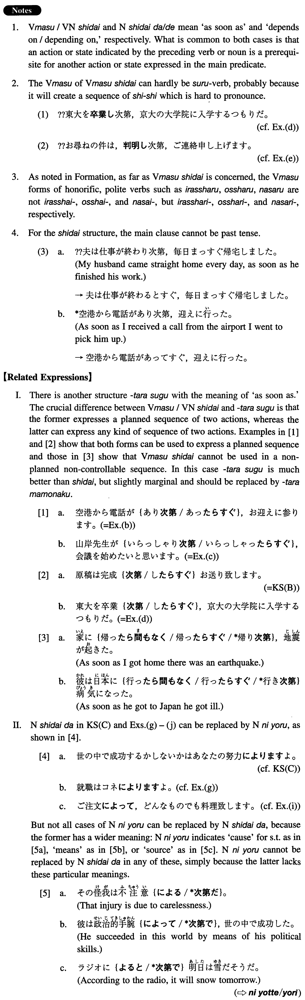

# 次第

[1. Summary](#summary) 
[2. Formation](#formation) 
[3. Example Sentences](#example-sentences) 
[4. Grammar Book Page](#grammar-book-page) 

## Summary

<table><tr>   <td>Summary</td>   <td>A conjunction/noun to express that an action indicated by a preceding verb or an action implied by a preceding noun is a prerequisite for another action.</td></tr><tr>   <td>English</td>   <td>As soon as; depend on</td></tr><tr>   <td>Part of speech</td>   <td>Conjunction/Noun</td></tr><tr>   <td>Related expression</td>   <td>による; たらすぐ</td></tr></table>

## Formation

<table class="table"><tbody><tr class="tr head"><td class="td">(i) Vます</td><td class="td">次第</td><td class="td"></td></tr><tr class="tr"><td class="td"></td><td class="td">読み次第</td><td class="td">As soon as someone has read something</td></tr><tr class="tr"><td class="td"></td><td class="td">帰り次第</td><td class="td">As soon as someone has returned</td></tr><tr class="tr head"><td class="td">Exception</td><td class="td">いらっしゃり次第</td><td class="td">As soon as someone comes/goes there</td></tr><tr class="tr"><td class="td"></td><td class="td">おっしゃり次第</td><td class="td">As soon as someone says it</td></tr><tr class="tr"><td class="td"></td><td class="td">なさり次第</td><td class="td">As soon as someone does something</td></tr><tr class="tr head"><td class="td">(ii) VN</td><td class="td">次第</td><td class="td"></td></tr><tr class="tr"><td class="td"></td><td class="td">帰国次第</td><td class="td">As soon as someone comes back to his/her country</td></tr><tr class="tr"><td class="td"></td><td class="td">到着次第</td><td class="td">As soon as someone/something arrives</td></tr><tr class="tr head"><td class="td">(iii) (Xは)Noun</td><td class="td">次第だ/で</td><td class="td"></td></tr><tr class="tr"><td class="td"></td><td class="td">(農業は)天気次第だ</td><td class="td">Farming depends on the weather</td></tr><tr class="tr"><td class="td"></td><td class="td">給料次第で</td><td class="td">Depending on the salary</td></tr></tbody></table>

## Example Sentences

<table><tr>   <td>大阪に着き次第、お電話を差し上げます。</td>   <td>As soon as I get to Osaka, I will call you.</td></tr><tr>   <td>原稿は完成次第お送り致します。</td>   <td>I will send my manuscripts as soon as they are completed.</td></tr><tr>   <td>世の中で成功するかしないかはあなたの努力次第ですよ。</td>   <td>Whether you succeed in the world or not depends on your efforts.</td></tr><tr>   <td>夫は仕事が終わり次第、毎日まっすぐ帰宅します。</td>   <td>My husband comes straight home every day, as soon as he has finished his work.</td></tr><tr>   <td>空港から電話があり次第、お迎えに参ります。</td>   <td>I will go to pick you up as soon as you call me from the airport.</td></tr><tr>   <td>山岸先生がいらっしゃり次第、会議を始めたいと思います。</td>   <td>As soon as Professor Yamagishi comes here I'd like to begin our meeting.</td></tr><tr>   <td>東大を卒業次第、京大の大学院に入学するつもりだ。</td>   <td>Upon graduation from the University of Tokyo, I intend to enter the Graduate School of Kyoto University.</td></tr><tr>   <td>お尋ねの件は、判明次第、ご連絡申し上げます。</td>   <td>On the matter you have inquired about, I will inform you as soon as I find out.</td></tr><tr>   <td>レセプションが終了次第、晩餐会を始めます。</td>   <td>As soon as the reception is finished we will start the dinner party.</td></tr><tr>   <td>就職はコネ次第ですよ。</td>   <td>Finding employment depends on connections.</td></tr><tr>   <td>「地獄の沙汰も金次第（だ）」ということわざを知っていますか。</td>   <td>Do you know the proverb &quot;Even affairs in hell depend on money&rdquo;?</td></tr><tr>   <td>ご注文次第で、どんな物でも料理致します。</td>   <td>Depending on your orders, I will cook you anything you like.</td></tr><tr>   <td>条件次第では、その仕事を引き受けたいと思います。</td>   <td>Depending on the employment terms I would like to accept that job.</td></tr></table>

## Grammar Book Page

