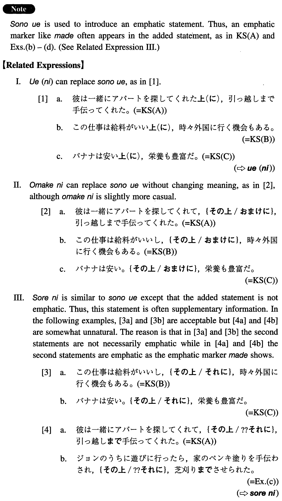

# その上

[1. Summary](#summary) 
[2. Formation](#formation) 
[3. Example Sentences](#example-sentences) 
[4. Grammar Book Page](#grammar-book-page) 

## Summary

<table><tr>   <td>Summary</td>   <td>A conjunction which introduces an additional, emphatic statement.</td></tr><tr>   <td>English</td>   <td>On top of that; besides; moreover; furthermore; what's more; what's worse; not only ~ but also</td></tr><tr>   <td>Part of speech</td>   <td>Conjunction</td></tr><tr>   <td>Related expression</td>   <td>おまけに; しかも; それに; うえ(に)</td></tr></table>

## Formation

<table class="table"><tbody><tr class="tr head"><td class="td">(i) {V/Adjective/Noun+Copula}て</td><td class="td">その上</td><td class="td"></td></tr><tr class="tr"><td class="td"></td><td class="td">いつでも使えて、その上、無料だ</td><td class="td">You can use it any time, and on top of that, it’s free</td></tr><tr class="tr"><td class="td"></td><td class="td">おいしくて、その上、栄養がある</td><td class="td">It’s delicious and what’s more， nutritious</td></tr><tr class="tr"><td class="td"></td><td class="td">不便で、その上、家賃が高い</td><td class="td">It’s inconvenient, and moreover，the rent is expensive.</td></tr><tr class="tr"><td class="td"></td><td class="td">純金製で、その上、ダイヤがはまっている</td><td class="td">It’s made of pure gold, and besides, it has a diamond (literally: a diamond is embedded) </td></tr><tr class="tr head"><td class="td">(ii) Vます</td><td class="td">その上</td><td class="td"></td></tr><tr class="tr"><td class="td"></td><td class="td">ほめられ、その上、ほうびまでもらった</td><td class="td">I was praised，and what’s more, I was given an award</td></tr><tr class="tr head"><td class="td">(iii) Adjective い</td><td class="td">くその上</td><td class="td"></td></tr><tr class="tr"><td class="td"></td><td class="td">話が面白く、その上、読みやすい</td><td class="td">The story is interesting, and on top of that, it’s easy to read</td></tr><tr class="tr head"><td class="td">(iv) Sentence し</td><td class="td">その上</td><td class="td"></td></tr><tr class="tr"><td class="td"></td><td class="td">その仕事はつまらないし、その上、給料が悪い</td><td class="td">The job is boring, and what’s worse, the pay is bad</td></tr><tr class="tr head"><td class="td">(v) Sentence</td><td class="td">その上</td><td class="td"></td></tr><tr class="tr"><td class="td"></td><td class="td">その老人は体が不自由。その上、耳が遠い</td><td class="td">The old man is disabled. Furthermore, he is hard of hearing</td></tr></tbody></table>

## Example Sentences

<table><tr>   <td>彼は一緒にアパートを探してくれて、その上、引っ越しまで手伝ってくれた。</td>   <td>He looked for an apartment with me, and moreover, he even helped me move.</td></tr><tr>   <td>この仕事は給料がいいし、その上、時々外国に行く機会もある。</td>   <td>This job pays a good salary, and what's more, it offers opportunities to go abroad from time to time.</td></tr><tr>   <td>バナナは安い。その上、栄養も豊富だ。</td>   <td>Bananas are cheap. On top of that, they are nutritious.</td></tr><tr>   <td>彼女は美人で、その上、気立てがいいから、みんなに好かれている。</td>   <td>Everybody loves her because she is not only pretty but also good-natured (literally: because she is pretty, and what's more, she is good-natured).</td></tr><tr>   <td>先生のうちに就職の相談に行ったら、色々アドバイスを頂いて、その上、夕食までごちそうになった。</td>   <td>When I went to my professor's house to consult him about my job, he gave me all kinds of advice, and on top of that, he even served me dinner.</td></tr><tr>   <td>ジョンのうちに遊びに行ったら、家のペンキ塗りを手伝わされ、その上、芝刈りまでさせられた。</td>   <td>When I went to see John at his place, he got me to help him paint his house, and what's more, he even got me to mow the lawn.</td></tr><tr>   <td>このアパートは通勤に便利で家賃も安く、その上、駐車場まである。</td>   <td>This apartment is convenient for commuting and the rent is reasonable. Moreover, it even has a parking space.</td></tr><tr>   <td>日本語は構造が英語とかなり違うし、その上、漢字があるから、アメリカ人に習得が難しい。</td>   <td>The structure of Japanese is considerably different from that of English, and on top of that, it has kanji; therefore, it is difficult for Americans to learn.</td></tr><tr>   <td>この学校はいい先生が少なく設備もよくない。その上、生徒の非行も多い。</td>   <td>This school does not have many good teachers and the facilities are not good, either. And besides that, there is a lot of juvenile crime.</td></tr></table>

## Grammar Book Page

