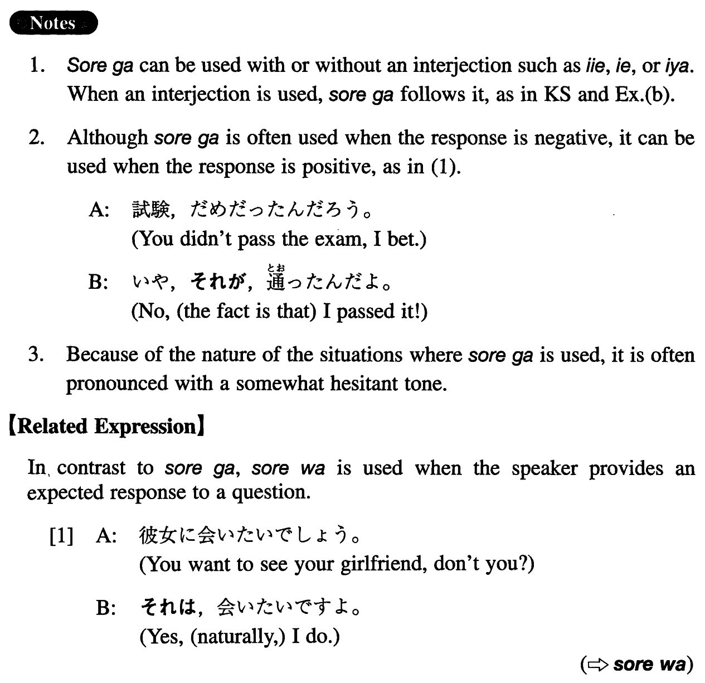

# それが

[1. Summary](#summary) 
[2. Example Sentences](#example-sentences) 
[3. Grammar Book Page](#grammar-book-page) 

## Summary

<table><tr>   <td>Summary</td>   <td>An interjection which signals that the speaker is going to provide an unexpected response to a question.</td></tr><tr>   <td>English</td>   <td>Well (contrary to your expectation; I'm afraid to say this, but)</td></tr><tr>   <td>Part of speech</td>   <td>Interjection (used in conversation only)</td></tr><tr>   <td>Related expression</td>   <td>それは; ところが</td></tr></table>

## Example Sentences

<table><tr>   <td>Ａ：奨学金がもらえそうですか。Ｂ：（いえ）それが難しそうなんです。</td>   <td>A: Does it look like you can get a scholarship? B: Well, (no,) it looks difficult.</td></tr><tr>   <td>A:試験、どうだった？B:それが、駄目だったんだ。</td>   <td>A: How was the exam? B: Well, (I'm sorry to say this, but) it was no good.</td></tr><tr>   <td>A:来年は日本で働くんですね。B:いや、それが行けなくなってしまったんです。</td>   <td>A: You're going to work in Japan next year, aren't you? B: Well, no, it's turned out that I can't go.</td></tr><tr>   <td>A：彼女に会って話したんだろう。B:それが、合ったことは合ったんだけど、顔を見たら何も言えなくなってしまって。</td>   <td>A: You met her and talked to her, right? B: Well, I did meet her, but when I saw her face, I couldn't say anything.</td></tr></table>

## Grammar Book Page

