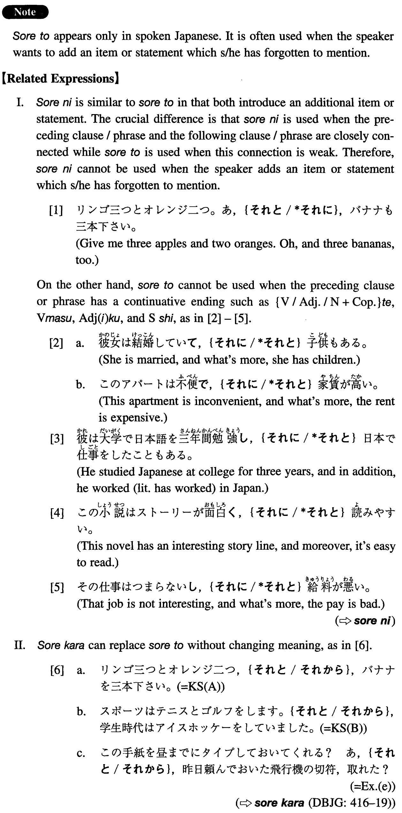

# それと

[1. Summary](#summary) 
[2. Formation](#formation) 
[3. Example Sentences](#example-sentences) 
 

## Summary

<table><tr>   <td>Summary</td>   <td>A conjunction which introduces an additional item or statement.</td></tr><tr>   <td>English</td>   <td>And; also; in addition; as well</td></tr><tr>   <td>Part of speech</td>   <td>Conjunction (used in conversation only)</td></tr><tr>   <td>Related expression</td>   <td>それから; それに</td></tr></table>

## Formation

<table class="table"><tbody><tr class="tr head"><td class="td">(i) Noun1{と/に/、}Noun2{と/に/、}</td><td class="td">…それと、Noun</td><td class="td"></td></tr><tr class="tr"><td class="td"></td><td class="td">ビールとチーズ、それと、ポテトチップ</td><td class="td">Beer and cheese, and potato chips as well</td></tr><tr class="tr head"><td class="td">(ii) Sentence1</td><td class="td">それと、Sentence2</td><td class="td"></td></tr><tr class="tr"><td class="td"></td><td class="td">音楽はコーラスをしています。それと、学生の頃フルートを少しやりました</td><td class="td">Speaking of music, I am a member of a chorus. In addition,    I played flute a little when I was a student</td></tr></tbody></table>

## Example Sentences

<table><tr>   <td>林檎三つとオレンジ二つ、それと、バナナを三本下さい。</td>   <td>Give me three apples and two oranges, and three bananas, as well.</td></tr><tr>   <td>スポーツはテニスとゴルフをします。それと、学生時代はアイスホッケーをしていました。</td>   <td>S1: Speaking of sports, I play tennis and golf. S2: In addition, I played ice hockey at school (literally: in my school days).</td></tr><tr>   <td>山田さん、木下さん、上野さん、それと、高橋さんもお見えになります。</td>   <td>Mr. Yamada, Mr. Kinoshita, and Mr. Ueno are coming. And Mr. Takahashi, too.</td></tr><tr>   <td>外国語はドイツ語にフランス語、それと、日本語が少しが話せます。</td>   <td>Talking about foreign languages, I can speak German and French, and a little Japanese.</td></tr><tr>   <td>留守中に山村さんと浜田さんからお電話がありました。それと、吉田さんからお手紙が来ております。</td>   <td>There were calls from Mr. Yamamura and Mr. Hamada while you were out. Also, a letter came from Mr. Yoshida.</td></tr><tr>   <td>緊急の問題は先生をどうするかということです。それと、もう一つ、教室の問題も考えなければなりません。</td>   <td>How to get a teacher is the urgent problem. And, for another thing, we have to think about the classroom problem.</td></tr><tr>   <td>この手紙を昼までにタイプしておいてくれる？あ、それと、昨日頼んでおいた飛行機の切符、取れた？</td>   <td>Could you type this letter by noon? Oh, and did (literally: could) you get the air tickets I asked for yesterday?</td></tr></table>

## Grammar Book Page

