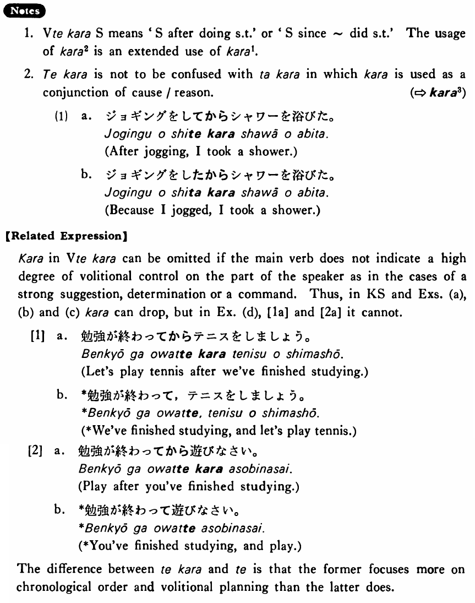

# から (2)

[1. Summary](#summary) 
[2. Formation](#formation) 
[3. Example Sentences](#example-sentences) 
[4. Explanation](#explanation) 
[5. Grammar Book Page](#grammar-book-page) 

## Summary

<table><tr>   <td>Summary</td>   <td>After/since a point in time at which something takes place.</td></tr><tr>   <td>English</td>   <td>After; having done something; since (time)</td></tr><tr>   <td>Part of speech</td>   <td>Conjunction</td></tr><tr>   <td>Related expression</td>   <td>あとで; てform of verb</td></tr></table>

## Formation

<table class="table"> <tbody><tr class="tr head"> <td class="td">Vてから</td> <td class="td">話してから </td> <td class="td">After    talking</td> </tr> <tr class="tr"> <td class="td">&nbsp;</td> <td class="td">食べてから </td> <td class="td">After    eating</td> </tr></tbody></table>

## Example Sentences

<table><tr>   <td>雪子は晩ご飯を食べてから映画に行った・行きました。</td>   <td>After eating her supper, Yukiko went to a movie.</td></tr><tr>   <td>私は友達に電話してからうちを出た。</td>   <td>I left home after making a call to my friend.</td></tr><tr>   <td>ジョーンズさんはいつもシャワーを浴びてから寝ます。</td>   <td>Mr. Jones always goes to bed after taking a shower.</td></tr><tr>   <td>私達がこの家を買ってからもう十年になる。</td>   <td>It's already been ten years since we bought this house.</td></tr><tr>   <td>二年前に交通事故を起こしてから、ミラーさんは車に乗らないようにしています。</td>   <td>Since he caused a traffic accident two years ago, Mr. Miller has been trying not to drive a car.</td></tr></table>

## Explanation

1. Verbてから Sentence means 'Sentence after doing something' or 'Sentence since ~ did something'. The usage of から2 is an extended use of から1.
  
2. てから is not to be confused with たから in which から is used as a conjunction of cause/reason.
   
(⇨ <a href="#㊦ から (3)">から3</a>)
  <ul>(1) <li>a. ジョギングをしてからシャワーを浴びた。</li> <li>After jogging, I took a shower.</li> 

 <li>b. ジョギングをしたからシャワーを浴びた。</li> <li>Because I jogged, I took a shower.</li> </ul>  
【Related Expression】
  
から in Verbてから can be omitted if the main verb does not indicate a high degree of volitional control on the part of the speaker as in the cases of a strong suggestion, determination or a command. Thus, in Key Sentence and Examples (a), (b) and (c) から can drop, but in Example (d), [1a] and [2a] it cannot.
  
[1]
  <ul> <li>a. 勉強が終わってからテニスをしましょう。</li> <li>Let's play tennis after we've finished studying.</li> 

 <li>b. *勉強が終わって，テニスをしましょう。</li> <li>*We've finished studying, and let's play tennis.</li> </ul>  
[2]
  <ul> <li>a. 勉強が終わってから遊びなさい。</li> <li>Play after you've finished studying.</li> 

 <li>b. *勉強が終わって遊びなさい。</li> <li>*You've finished studying, and play.</li> </ul>  
The difference between てから and て is that the former focuses more on chronological order and volitional planning than the latter does.
  

## Grammar Book Page

