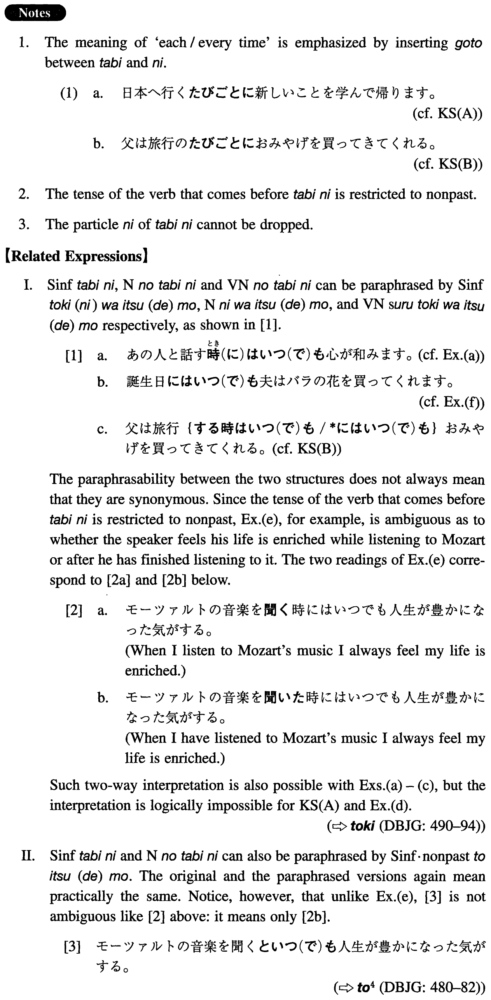

# たびに

[1. Summary](#summary) 
[2. Formation](#formation) 
[3. Example Sentences](#example-sentences) 
[4. Grammar Book Page](#grammar-book-page) 

## Summary

<table><tr>   <td>Summary</td>   <td>A conjunction to express that each time someone/something does something, something else takes place.</td></tr><tr>   <td>Equivalent</td>   <td>Every time; each time; on every occasion; whenever</td></tr><tr>   <td>Part of speech</td>   <td>Conjunction</td></tr><tr>   <td>Related expression</td>   <td>いつ(で)も; といつ(で)も; 時(に)は</td></tr></table>

## Formation

<table class="table"><tbody><tr class="tr head"><td class="td">(i) Vinformal nonpast</td><td class="td">たびに</td><td class="td"></td></tr><tr class="tr"><td class="td"></td><td class="td">食べるたびに</td><td class="td">Each time someone eats something</td></tr><tr class="tr"><td class="td"></td><td class="td">勉強するたびに</td><td class="td">Each time someone studies (something) </td></tr><tr class="tr head"><td class="td">(ii) Noun</td><td class="td">のたびに</td><td class="td"></td></tr><tr class="tr"><td class="td"></td><td class="td">試験のたびに</td><td class="td">On every examination occasion</td></tr><tr class="tr head"><td class="td">(iii) VN</td><td class="td">のたびに</td><td class="td"></td></tr><tr class="tr"><td class="td"></td><td class="td">勉強のたびに</td><td class="td">On every occasion of study</td></tr></tbody></table>

## Example Sentences

<table><tr>   <td>日本へ行くたびに新しいことを学んで帰ります。</td>   <td>Each time I go to Japan I come home having learned something new.</td></tr><tr>   <td>父は旅行のたびにお土産を買ってきてくれる。</td>   <td>On every trip my father comes back with souvenirs.</td></tr><tr>   <td>あの人と話すたびに心が和みます。</td>   <td>Each time I talk with her my heart softens.</td></tr><tr>   <td>この本は読むたびに新しい発見がある。</td>   <td>Each time I read this book I make new findings.</td></tr><tr>   <td>僕は東京に行くたびに恩師のお宅を訪ねることにしている。</td>   <td>I make it a point of visiting my professor's residence every time I go to Tokyo.</td></tr><tr>   <td>私の孫は会うたびに前より大きくなっている。</td>   <td>My grandson is growing bigger than before each time I see him.</td></tr><tr>   <td>モーツアルトの音楽を聞くたびに人生が豊かになった気がする。</td>   <td>Each time I listen to Mozart's music I feel my life is enriched.</td></tr><tr>   <td>誕生日のたびに夫は薔薇の花を買ってくれます。</td>   <td>On every birthday my husband buys me roses.</td></tr><tr>   <td>うちでは給料日のたびに銀座のレストランで食事をします。</td>   <td>Our family eats at a restaurant in Ginza every payday.</td></tr></table>

## Grammar Book Page

