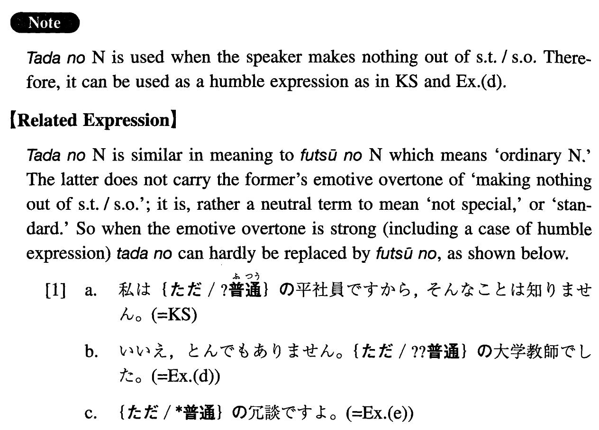

# ただの

 
 
 
 

## Summary

<table><tr>   <td>Summary</td>   <td>Not deserving to be mentioned.</td></tr><tr>   <td>English</td>   <td>Usual; ordinary; plain; common; rank and file</td></tr><tr>   <td>Part of speech</td>   <td>Phrase</td></tr><tr>   <td>Related expression</td>   <td>普通の; に過ぎない</td></tr></table>

## Formation

<table class="table"><tbody><tr class="tr head"><td class="td">ただの</td><td class="td">Noun</td><td class="td"></td></tr><tr class="tr"><td class="td"></td><td class="td">ただの先生</td><td class="td">An ordinary teacher</td></tr></tbody></table>

## Example Sentences

<table><tr>   <td>私はただの平社員ですから、そんなことは知りません。</td>   <td>I'm only an ordinary employee, so I'm not aware of that.</td></tr><tr>   <td>ただの風邪だと思っていたら、肺炎だった。</td>   <td>I thought it was an ordinary cold, but it was pneumonia.</td></tr><tr>   <td>あの人はただの学者ではないようですね。</td>   <td>He doesn't appear to be an ordinary scholar, does he?</td></tr><tr>   <td>ただの集まりだと思って、顔を出したら、偉い人達が出席していたのでびっくりした。</td>   <td>I put in an appearance because I thought it was an ordinary gathering, but to my surprise there were big shots attending.</td></tr><tr>   <td>A:お父様はお偉い方だったそうですね。B:いいえ、とんでもありません。ただの大学教師でした。</td>   <td>A: I heard that your father was a great man. B: No, not at all. He was an ordinary college professor.</td></tr><tr>   <td>ただの冗談ですよ。</td>   <td>I'm just kidding, you know.</td></tr></table>

## Grammar Book Page

