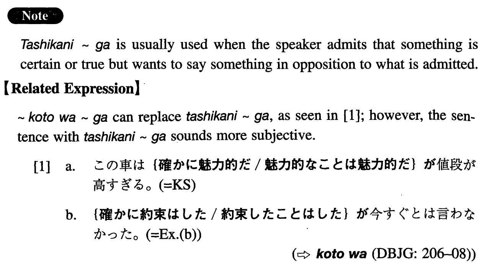

# 確かに~が

[1. Summary](#summary) 
[2. Example Sentences](#example-sentences) 
[3. Grammar Book Page](#grammar-book-page) 

## Summary

<table><tr>   <td>Summary</td>   <td>A structure which expresses the idea \"indeed ~ but\".</td></tr><tr>   <td>Equivalent</td>   <td>Indeed ~ but; certainly ~ but; truly ~ but; it is true that ~ but; I admit that ~ but; definitely ~ but</td></tr><tr>   <td>Part of speech</td>   <td>Structure</td></tr><tr>   <td>Related expression</td>   <td>ことは~が</td></tr></table>

## Example Sentences

<table><tr>   <td>この車は確かに魅力的だが、値段が高すぎる。</td>   <td>This car is certainly attractive, but the price is too high.</td></tr><tr>   <td>そのパーティーのことは確かに聞いたが、いつだったか思い出せない。</td>   <td>I certainly heard about the party, but I don't remember when it is going to be.</td></tr><tr>   <td>確かに約束はしたが、今すぐとは言わなかった。</td>   <td>It's true that I promised (to do it), but I didn't say that I would do it right now.</td></tr><tr>   <td>彼は確かに第一印象がよくないが、本当はいい男なんだよ。</td>   <td>He definitely makes a bad first impression, but actually he is a nice man.</td></tr><tr>   <td>この学校は確かにいい学校だが、僕には向いていない。</td>   <td>I admit that this is a good school, but it's not suitable for me.</td></tr><tr>   <td>確かに僕が悪かったが、そんなに怒ることはないだろう。</td>   <td>I admit that it was my fault (literally: I was bad.), but you shouldn't be that mad.</td></tr><tr>   <td>確かに多くの日本人が海外へ出かけるようになった。海外国語を上手に話す人も沢山いる。しかし、本当の国際人と呼べる人はまだ少ない。</td>   <td>It is true that many Japanese go abroad now. There are also many who speak other languages (literally: foreign languages) well. However, there are still few who can be called \"true internationalists\".</td></tr></table>

## Grammar Book Page

