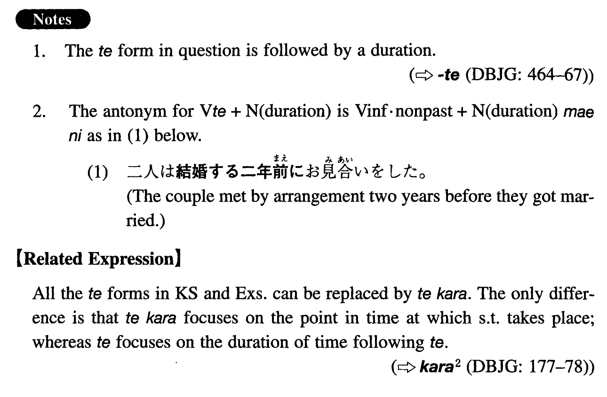

# て

 
 
 
 

## Summary

<table><tr>   <td>Summary</td>   <td>After/since a point in time at which something takes place.</td></tr><tr>   <td>English</td>   <td>And; since; having done something</td></tr><tr>   <td>Part of speech</td>   <td>て Form</td></tr><tr>   <td>Related expression</td>   <td>てから</td></tr></table>

## Formation

<table class="table"><tbody><tr class="tr head"><td class="td">Vて</td><td class="td">Duration</td><td class="td"></td></tr><tr class="tr"><td class="td"></td><td class="td">来て二年</td><td class="td">It has been two years since someone came</td></tr></tbody></table>

## Example Sentences

<table><tr>   <td>こちらにいらっしゃってもう何年になりますか。</td>   <td>How long have you been here / how many years it is since you came here?</td></tr><tr>   <td>二人は結婚して二年後に離婚した。</td>   <td>The couple got married and two years later they got divorced.</td></tr><tr>   <td>会社を辞めてもう久しい。</td>   <td>It has been a long time since I quit the company.</td></tr><tr>   <td>この島を訪れてもう何年になるだろうか。</td>   <td>I wonder how many years have already passed since I last visited this island.</td></tr><tr>   <td>この会社で働き始めてこれで四年になります。</td>   <td>It's been four years since I began to work at this company.</td></tr><tr>   <td>この町に来てまだ一週間目です。</td>   <td>It's my first week in this town.</td></tr></table>

## Grammar Book Page

