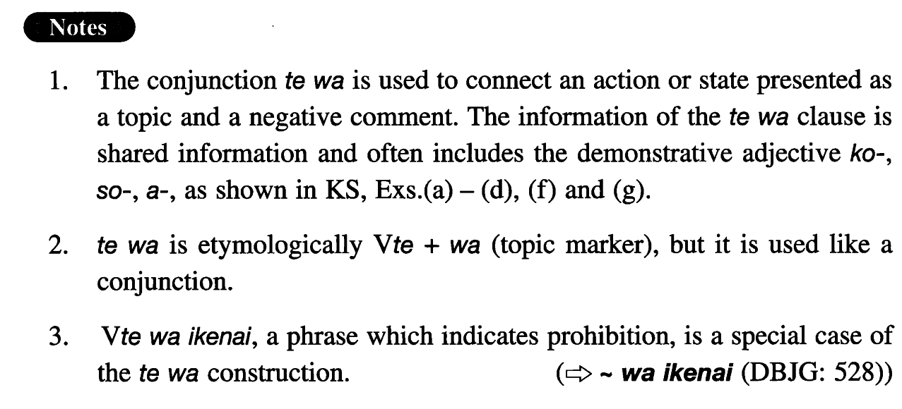

# ては

[1. Summary](#summary) 
[2. Formation](#formation) 
[3. Example Sentences](#example-sentences) 
[4. Grammar Book Page](#grammar-book-page) 

## Summary

<table><tr>   <td>Summary</td>   <td>A conjunction which presents an action/state as a topic about which a negative comment is given.</td></tr><tr>   <td>Equivalent</td>   <td>If; when; because</td></tr><tr>   <td>Part of speech</td>   <td>Conjunction</td></tr></table>

## Formation

<table class="table"><tbody><tr class="tr head"><td class="td">(i) Verb</td><td class="td">ては</td><td class="td"></td></tr><tr class="tr"><td class="td"></td><td class="td">食べては</td><td class="td">When/if one eats; to eat</td></tr><tr class="tr head"><td class="td">(ii) Adjective(い/な) </td><td class="td">ては</td><td class="td"></td></tr><tr class="tr"><td class="td"></td><td class="td">大きくては</td><td class="td">When/if something/someone is big</td></tr><tr class="tr"><td class="td"></td><td class="td">不便では</td><td class="td">When/if something is inconvenient</td></tr><tr class="tr head"><td class="td">(iii) Noun</td><td class="td">では</td><td class="td"></td></tr><tr class="tr"><td class="td"></td><td class="td">病気では(頼めない) </td><td class="td">If someone is ill (I can’t ask him to do something) </td></tr><tr class="tr"><td class="td"></td><td class="td">あの先生では(話にならない) </td><td class="td">That teacher (would be out of the question) </td></tr></tbody></table>

## Example Sentences

<table><tr>   <td>そんなに勉強しては、体を壊しますよ。</td>   <td>If you study that hard, you will ruin your health.</td></tr><tr>   <td>こんなに寒くては外出できません。</td>   <td>We cannot go out in this cold weather (literally: when it is this cold).</td></tr><tr>   <td>仕事がそんなに嫌いでは困りますね。</td>   <td>It's too bad that you hate your work that much.</td></tr><tr>   <td>そんなに遊んでいては、試験に失敗しますよ。</td>   <td>If you are fooling around like that, you will fail the examination.</td></tr><tr>   <td>あの男が来ては邪魔になる。</td>   <td>If he comes he will get in our way.</td></tr><tr>   <td>こんなに働かされては、病気になってしまうよ。</td>   <td>If I'm forced to work like this, I will end up by becoming ill.</td></tr><tr>   <td>こんなに部屋が汚くては、お客さんが見えた時に恥ずかしい。</td>   <td>Because the room is messy like this, I feel ashamed when I have a guest.</td></tr><tr>   <td>人が皆個人主義的では、国はやっていけない。</td>   <td>If everybody is individualistic, a country cannot get along well.</td></tr><tr>   <td>こんなに忙しくては、新聞も読めない。</td>   <td>When one is this busy, one cannot read even the newspaper.</td></tr><tr>   <td>あんな女性がデートの相手では、彼は小さくなっているだろう。</td>   <td>If a woman like her is his date, he must feel intimidated.</td></tr></table>

## Grammar Book Page

