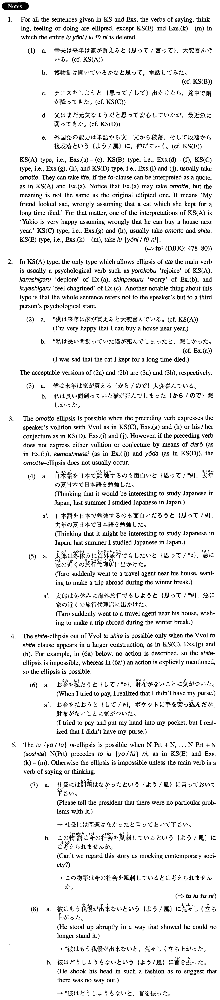

# と

 
 
 
 

## Summary

<table><tr>   <td>Summary</td>   <td>A particle which makes an adverbial clause, with a verb of saying/thinking/understood after it.</td></tr><tr>   <td>English</td>   <td>(thinking/saying) that ~; because; like; in such a way that ~</td></tr><tr>   <td>Part of speech</td>   <td>Particle</td></tr></table>

## Formation

<table class="table"><tbody><tr class="tr head"><td class="td">(i) {V/Adjective(い/な)}informal</td><td class="td">と(思って/言って) </td><td class="td">Verb of psychology</td></tr><tr class="tr"><td class="td"></td><td class="td">読めると(思って/言って)嬉しがっている</td><td class="td">Someone is happy thinking/saying that s/he can read it</td></tr><tr class="tr"><td class="td"></td><td class="td">面白いと(思って/言って)喜んでいる</td><td class="td">Someone is happy thinking/saying that something is    interesting</td></tr><tr class="tr"><td class="td"></td><td class="td">便利だと(思って/言って)嬉しがっている</td><td class="td">Someone is happy thinking/saying that something is    convenient</td></tr><tr class="tr head"><td class="td">(ii) Sentence (internal monologue) </td><td class="td">と(思って) </td><td class="td"></td></tr><tr class="tr"><td class="td"></td><td class="td">もう会うまいと、縁を切った</td><td class="td">Thinking that someone would not see someone else, he severed the relationship</td></tr><tr class="tr"><td class="td"></td><td class="td">映画でも見に行こうかなと、出かけた</td><td class="td">Wondering if I should go see a movie I left home</td></tr><tr class="tr head"><td class="td">(iii) Vvolitional</td><td class="td">と(思って/して) </td><td class="td"></td></tr><tr class="tr"><td class="td"></td><td class="td">食べようと(思って/して) </td><td class="td">Thinking that s/he would eat it</td></tr><tr class="tr head"><td class="td">(iv) {V/Adjective(い/な)}informal (conjectural) </td><td class="td">と(思って) </td><td class="td"></td></tr><tr class="tr"><td class="td"></td><td class="td">来ないだろうと(思って) </td><td class="td">Thinking that s/he might not come</td></tr><tr class="tr"><td class="td"></td><td class="td">うまらないかもしれないと(思って) </td><td class="td">Thinking that something might be boring</td></tr><tr class="tr"><td class="td"></td><td class="td">元気だろうと(思って) </td><td class="td">Thinking that someone might be healthy</td></tr><tr class="tr head"><td class="td">(v) NounParticle Noun, …NounParticle Noun</td><td class="td">(そして)NounParticleと(いう{よう/風}に)Verb</td><td class="td"></td></tr><tr class="tr"><td class="td"></td><td class="td">男は二階、女は一階と(いう{よう/風}に)部屋を分ける</td><td class="td">Someone divides the rooms in such a way that men are placed upstairs and women in the first floor</td></tr></tbody></table>

## Example Sentences

<table><tr>   <td>幸夫は来年は家が買えると大変喜んでいる。</td>   <td>Yukio is very happy that he can buy a house next year.</td></tr><tr>   <td>博物館は開いているかなと、電話してみた。</td>   <td>(internal monologue): Wondering if the museum is open I called them.</td></tr><tr>   <td>テニスをしようと出かけたら、途中で雨が降ってきた。</td>   <td>With the intention of playing tennis (literally: Thinking that I will play tennis) I went out, but on my way it started to rain.</td></tr><tr>   <td>父はまだ元気なようだと安心していたが、最近急に弱ってきた。</td>   <td>I felt at ease, thinking that my father still looked healthy, but suddenly he began to grow weak.</td></tr><tr>   <td>外国語の能力は単語から文、文から段落、そして段落から複段落と、伸びていく。</td>   <td>Foreign language proficiency develops from words to sentences, from sentences to paragraphs, and then from paragraphs to complex paragraphs.</td></tr><tr>   <td>友達は長い間飼っていた猫が死んでしまったと、悲しがっていた。</td>   <td>My friend looked sad, saying that a cat, which she kept for a long time, had died.</td></tr><tr>   <td>彼は癌になったかもしれないと心配している。</td>   <td>He is worried that he may have cancer.</td></tr><tr>   <td>その学生はもうちょっとで百点が取れたのにと、悔しがった。</td>   <td>That student felt chagrined that he could almost get 100 points.</td></tr><tr>   <td>彼女と会うのもこれが最後かと、寂しかったのです。</td>   <td>Thinking that this would be the last time to see her, I felt lonely.</td></tr><tr>   <td>変な音がしたなと、外に出てみたが、何でもなかった。</td>   <td>Wondering what the strange noise was, I went outside, but it was nothing.</td></tr><tr>   <td>僕は今晩は酒を飲むまいと、まっすぐ家に帰った。</td>   <td>I came straight home, thinking that I would not drink tonight.</td></tr><tr>   <td>年内に論文を仕上げようと、懸命に努力しているところです。</td>   <td>Thinking that I should complete the paper before the end of the year, I am right now doing my very best.</td></tr><tr>   <td>彼にお礼を言おうとやって来たのに、ほかのことばかり話して、お礼を言うのを忘れてしまった。</td>   <td>I came here intending to thank him, but I just talked about something else, and forgot to thank him.</td></tr><tr>   <td>少しは体にいいだろうと、最近は散歩をしています。</td>   <td>I thought it would make a small improvement to my body, so I am taking walks these days.</td></tr><tr>   <td>宿題を忘れたので先生に叱られるかもしれないと、ビクビクしていた。</td>   <td>I forgot my homework so I feared that I might be scolded by my teacher.</td></tr><tr>   <td>日本の四季は、春は三月から五月、夏は六月から八月、秋は九月から十一月、冬は十二月から二月までと、どの季節もほぼ同じ長さになっている。</td>   <td>In Japan the four seasons are of approximately equal length, in such a way that spring is from March through May, summer from June through August, autumn from September through November, and winter from December through February.</td></tr></table>

## Grammar Book Page

