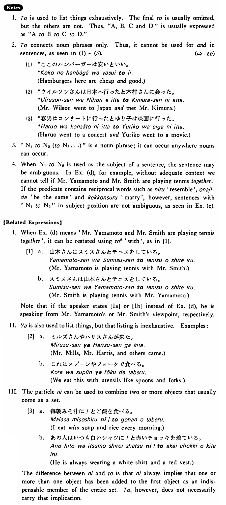

# と (1)

[1. Summary](#summary) 
[2. Example Sentences](#example-sentences) 
[3. Explanation](#explanation) 
[4. Grammar Book Page](#grammar-book-page) 

## Summary

<table><tr>   <td>Summary</td>   <td>A particle which lists things exhaustively.</td></tr><tr>   <td>English</td>   <td>And</td></tr><tr>   <td>Part of speech</td>   <td>Particle</td></tr><tr>   <td>Related expression</td>   <td>に (and); と2; や</td></tr></table>

## Example Sentences

<table><tr>   <td>マイクとディック（と）は学生だ・です。</td>   <td>Mike and Dick are students.</td></tr><tr>   <td>私は英語と日本語を話す。</td>   <td>I speak English and Japanese.</td></tr><tr>   <td>ミルズさんは来年ドイツとフランスとスペインへ行くつもりだ。</td>   <td>Mr. Mills is planning to go to Germany, France and Spain next year.</td></tr><tr>   <td>ステーキはナイフとフォークで食べる。</td>   <td>We eat steak with a knife and fork.</td></tr><tr>   <td>山本さんとスミスさんがテニスをしている。</td>   <td>Mr. Yamamoto and Mr. Smith are playing tennis.</td></tr><tr>   <td>日本語とトルコ語は似ている。</td>   <td>Japanese and Turkish are alike.</td></tr></table>

## Explanation

1. と is used to list things exhaustively. The final と is usually omitted, but the others are not. Thus, "A, B, C and D" is usually expressed as "AとBとCとD."
  
2. と connects noun phrases only. Thus, it cannot be used for 'and' in sentences, as seen in (1) - (3).
  
(⇨ <a href="#㊦ て">て</a>)
  <ul>(1) <li>*ここのハンバーガーは安いといい。</li> <li>Hamburgers here are cheap and good.</li> </ul>  <ul>(2) <li>*ウイルソンさんは日本へ行ったと木村さんに会った。</li> <li>Mr. Wilson went to Japan and met Mr. Kimura.</li> </ul>  <ul>(3) <li>*春男はコンサートに行ったとゆり子は映画に行った。</li> <li>Haruo went to a concert and Yuriko went to a movie.</li> </ul>  
3.  "Noun1とNoun2(とNoun3...)" is a noun phrase; it can occur anywhere nouns can occur.
  
4. When Noun1とNoun2 is used as the subject of a sentence, the sentence may be ambiguous. In Example (d), for example, without adequate context we cannot tell if Mr. Yamamoto and Mr. Smith are playing tennis together. If the predicate contains reciprocal words such as 似る 'resemble', 同じだ 'be the same' and 結婚する 'marry', however, sentences with "Noun1とNoun2" in subject position are not ambiguous, as seen in Example (e).
  
【Related Expressions】
  
I. When Example (d) means 'Mr. Yamamoto and Mr. Smith are playing tennis together' it can be restated using と2 'with', as in [1].
  
[1]
  <ul> <li>a. 山本さんはスミスさんとテニスをしている。</li> <li>Mr. Yamamoto is playing tennis with Mr. Smith.</li> 

 <li>b. スミスさんは山本さんとテニスをしている。</li> <li>Mr. Smith is playing tennis with Mr. Yamamoto.</li> </ul>  
Note that if the speaker states [1a] or [1b] instead of Example (d), he is speaking from Mr. Yamamoto's or Mr, Smith's viewpoint, respectively.
  
II. や is also used to list things, but that listing is inexhaustive. Examples:
  
[2]
  <ul> <li>a. ミルズさんやハリスさんが来た。</li> <li>Mr. Mills, Mr. Harris, and others came.</li> 

 <li>b. これはスプーンやフォークで食べる。</li> <li>We eat this with utensils like spoons and forks.</li> </ul>  
III. The particle に can be used to combine two or more objects that usually come as a set.
  
[3]
  <ul> <li>a. 毎朝みそ汁に/とご飯を食べる。</li> <li>I eat miso soup and rice every morning.</li> 

 <li>b. あの人はいつも白いシャツに/と赤いチョッキを着ている。</li> <li>He is always wearing a white shirt and a red vest.</li> </ul>  
The difference between に and と is that に always implies that one or more than one object has been added to the first object as an indispensable member of the entire set. と, however, does not necessarily carry that implication.

## Grammar Book Page

