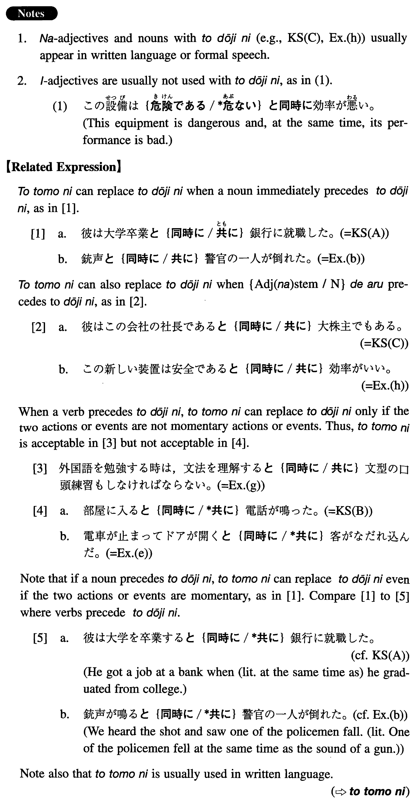

# と同時に

[1. Summary](#summary) 
[2. Formation](#formation) 
[3. Example Sentences](#example-sentences) 
 

## Summary

<table><tr>   <td>Summary</td>   <td>A phrase which is used to express the idea that someone does something or something takes place at the same time as another action or event, or that someone or something is in two states simultaneously.</td></tr><tr>   <td>English</td>   <td>At the same time (as); at the time; when; as; while; as well as ~</td></tr><tr>   <td>Part of speech</td>   <td>Compound Particle/Conjunction</td></tr><tr>   <td>Related expression</td>   <td>と共に; 途端(に)</td></tr></table>

## Formation

<table class="table"><tbody><tr class="tr head"><td class="td">(i) Noun</td><td class="td">と同時に</td><td class="td"></td></tr><tr class="tr"><td class="td"></td><td class="td">到着と同時に</td><td class="td">At the same time as someone’s arrival</td></tr><tr class="tr head"><td class="td">(ii) Vinformal nonpast</td><td class="td">と同時に</td><td class="td"></td></tr><tr class="tr"><td class="td"></td><td class="td">着くと同時に</td><td class="td">At the same time as someone arrives</td></tr><tr class="tr head"><td class="td">(iii) {Adjective な stem/Noun}である</td><td class="td">と同時に{Adjective な stem/Noun}である</td><td class="td"></td></tr><tr class="tr"><td class="td"></td><td class="td">便利であると同時に経済的である</td><td class="td">Something is economical as well as convenient</td></tr><tr class="tr"><td class="td"></td><td class="td">フットボールの選手であると同時に野球の選手である</td><td class="td">Someone is a baseball player as well as a football player</td></tr></tbody></table>

## Example Sentences

<table><tr>   <td>彼は大学卒業と同時に銀行に就職した。</td>   <td>He got a job at a bank at the time of (literally: at the same time as) his graduation from college.</td></tr><tr>   <td>部屋に入ると同時に電話が鳴った。</td>   <td>The telephone rang (literally: at the same time) as I entered the room.</td></tr><tr>   <td>彼はこの会社の社長であると同時に大株主でもある。</td>   <td>He is the president of this company and, at the same time, a big stockholder.</td></tr><tr>   <td>彼女は結婚と同時に会社を辞めた。</td>   <td>She quit her company at the time of (literally: at the same time as) her marriage.</td></tr><tr>   <td>銃声と同時に警官の一人が倒れた。</td>   <td>We heard the shot and saw one of the policemen fall. (literally: One of the policemen fell at the same time as the sound of a gun.)</td></tr><tr>   <td>新しい単語の学習と同時に文法の復習も忘れてはならない。</td>   <td>You mustn't forget grammar review as well as new vocabulary study.</td></tr><tr>   <td>私はルースと同時に日本語の勉強を始めた。</td>   <td>I started my Japanese study when (literally: at the same time as) Ruth did.</td></tr><tr>   <td>電車が止まってドアが開くと同時に客がなだれ込んだ。</td>   <td>The train came to a halt and as the doors opened the passengers rushed into the train (literally: the passengers rushed into the train at the same time as the doors opened).</td></tr><tr>   <td>新社長は就任すると同時に社名を変更した。</td>   <td>The new president changed the company's name when (literally: at the same time as) he assumed the presidency.</td></tr><tr>   <td>外国語を勉強する時は、文法を理解すると同時に文型の口頭練習もしなければならない。</td>   <td>When you study a foreign language, while you learn (literally: understand) grammar, you must also practice sentence patterns orally.</td></tr><tr>   <td>この新しい装置は安全であると同時に効率がいい。</td>   <td>This new equipment is safe and, at the same time, its performance is good.</td></tr><tr>   <td>森鷗外は医者であると同時に小説家でもあった。</td>   <td>Mori Ogai was a novelist as well as a doctor.</td></tr></table>

## Grammar Book Page

