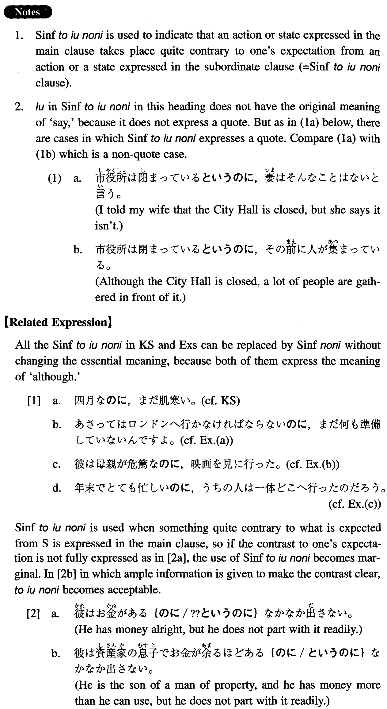

# というのに

[1. Summary](#summary) 
[2. Formation](#formation) 
[3. Example Sentences](#example-sentences) 
[4. Grammar Book Page](#grammar-book-page) 

## Summary

<table><tr>   <td>Summary</td>   <td>A conjunction to indicate that an action/state takes place quite contrary to one's expectation.</td></tr><tr>   <td>English</td>   <td>But; although; in spite of the fact that ~</td></tr><tr>   <td>Part of speech</td>   <td>Conjunction</td></tr><tr>   <td>Related expression</td>   <td>のに</td></tr></table>

## Formation

<table class="table"><tbody><tr class="tr head"><td class="td">Sinformal</td><td class="td">というのに</td><td class="td"></td></tr><tr class="tr"><td class="td"></td><td class="td">いい天気だというのに</td><td class="td">Although it is a fine day</td></tr><tr class="tr"><td class="td"></td><td class="td">人が来るというのに</td><td class="td">Although someone is coming</td></tr><tr class="tr"><td class="td"></td><td class="td">無駄だというのに</td><td class="td">Although it is a waste</td></tr><tr class="tr"><td class="td"></td><td class="td">危ないというのに</td><td class="td">Although it is dangerous</td></tr></tbody></table>

## Example Sentences

<table><tr>   <td>四月だというのに、まだ肌寒い。</td>   <td>It is April, but still chilly (literally: cold on the skin).</td></tr><tr>   <td>明後日はロンドンへ行かなければならないといのに、まだ何も準備していないんですよ。</td>   <td>Although I have to go to London the day after tomorrow, I haven't prepared anything yet, you know.</td></tr><tr>   <td>彼は母親が危篤だというのに、映画を見に行った。</td>   <td>He went to see a movie in spite of the fact that his mother is in a critical condition.</td></tr><tr>   <td>年末でとても忙しいというのに、うちの人は一体どこへ行ったのだろう。</td>   <td>It's the end of the year, and we are very busy, but where in the world did my husband go?</td></tr><tr>   <td>小学四年生だというのに、あの子はもう中学の数学をやっている。</td>   <td>The child is a fourth grader, but he is already studying junior high school math.</td></tr><tr>   <td>先生がわざわざ本を貸して下さったというのに、読んでいないの？</td>   <td>Your teacher kindly loaned a book to you, but you haven't read it?</td></tr><tr>   <td>学生は貧乏だというのに、結構いい車を乗り回しているね。</td>   <td>Students are said to be poor, but they are driving around in pretty good cars, aren't they?</td></tr></table>

## Grammar Book Page

