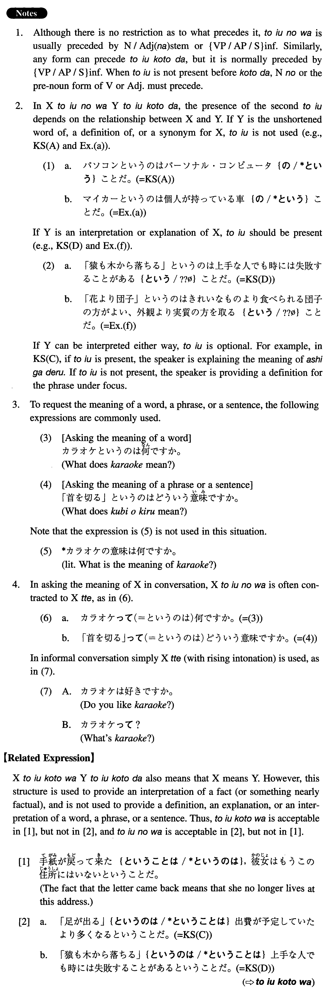

# というのは~ことだ

[1. Summary](#summary) 
[2. Formation](#formation) 
[3. Example Sentences](#example-sentences) 
 

## Summary

<table><tr>   <td>Summary</td>   <td>A structure which is used in interpreting, explaining, or defining a word, a phrase, or a sentence.</td></tr><tr>   <td>English</td>   <td>Mean; the meaning of ~ is; what ~ means is</td></tr><tr>   <td>Part of speech</td>   <td>Structure</td></tr><tr>   <td>Related expression</td>   <td>と言うことは</td></tr></table>

## Formation

<table class="table"><tbody><tr class="tr head"><td class="td">(i) Noun/Adjective な stem</td><td class="td">というのは</td><td class="td"></td></tr><tr class="tr"><td class="td"></td><td class="td">マンションというのは</td><td class="td">What manshon means is ~</td></tr><tr class="tr"><td class="td"></td><td class="td">独創的というのは</td><td class="td">Dokusouteki means ~</td></tr><tr class="tr head"><td class="td">(ii) {VP/AP/Sentence}informal</td><td class="td">というのは</td><td class="td"></td></tr><tr class="tr"><td class="td"></td><td class="td">「首を切る」というのは</td><td class="td">What kubi wo kiru (literally to cut one’s head off) means is ~</td></tr><tr class="tr"><td class="td"></td><td class="td">「溺れる者はわらをもつかむ」というのは</td><td class="td">What oboreru mono wa wara wo mo tsukamu (literally a drowning person cluthes even at a straw) means is ~</td></tr><tr class="tr head"><td class="td">(iii) のことだ</td><td class="td"></td><td class="td"></td></tr><tr class="tr"><td class="td"></td><td class="td">買取のアパートのことだ</td><td class="td">~ means an apartment for purchase</td></tr><tr class="tr head"><td class="td">(iv) Verb/Adjective</td><td class="td">ことだ</td><td class="td">The same as the relative clause formation rules</td></tr><tr class="tr"><td class="td"></td><td class="td">(何かをするのが)易しいことだ</td><td class="td">~ means ‘easy to do something’</td></tr><tr class="tr"><td class="td"></td><td class="td">(何かが)大好きなことだ</td><td class="td">~ means ‘to like someone a lot’</td></tr><tr class="tr"><td class="td"></td><td class="td">(何かが上手に)なることだ</td><td class="td">~ mean ‘to become skilful in something’</td></tr><tr class="tr head"><td class="td">(v) {VP/AP/Sentence}informal</td><td class="td">ということだ</td><td class="td"></td></tr><tr class="tr"><td class="td"></td><td class="td">細かい所ばかりを見て全体を見ないということだ</td><td class="td">~ means that one sees only details and does not see the whole</td></tr></tbody></table>

## Example Sentences

<table><tr>   <td>パソコンというのはパーソナル・コンピュータのことだ。</td>   <td>Pasokon means personal computer.</td></tr><tr>   <td>過労死というのは働き過ぎがもとで死ぬ（という）ことだ。</td>   <td>Karoushi means to die from overwork.</td></tr><tr>   <td>「足が出る」というのは出費が予定していたより多くなる（という）ことだ。</td>   <td>Ashi ga deru (literally: a foot sticks out) means that an expense exceeds the amount budgeted.</td></tr><tr>   <td>「猿も木から落ちる」というのは上手な人でも時には失敗することがあるということだ。</td>   <td>Saru mo ki kara ochiru (literally: even monkeys fall from trees) means that even a skilful person sometimes makes a mistake.</td></tr><tr>   <td>マイカーというのは個人が持っている車のことだ。</td>   <td>Maikaa (literally: my car) means a car owned by an individual.</td></tr><tr>   <td>裏口入学というのは試験を受けないで学校に入ることだ。</td>   <td>Uraguchi-nyuugaku (literally: entering school through the back door) means to enter a school without taking an entrance exam.</td></tr><tr>   <td>「口が軽い」というのは人に言ってはいけないことをすぐ言ってしまう（という）ことだ。</td>   <td>Kuchi ga karui (literally: one's mouth is light) means easily telling others things one shouldn't.</td></tr><tr>   <td>「頭を絞る」というのはいいアイディアを出そうとして一生懸命考える（という）ことだ。</td>   <td>Atama wo shiboru (literally: squeeze one's head) means to think hard to get good ideas.</td></tr><tr>   <td>「猫の額のような」というのは場所がとても狭い（という）ことだ。</td>   <td>Neko no hitai no youna (literally: like a cat's forehead) means that a place is very small (as in a very small yard).</td></tr><tr>   <td>「花より団子」というのは綺麗なものより食べられる団子の方がいい、外観より実質の方を取るということだ。</td>   <td>Hana yori dango (literally: dumplings rather than blossoms) means that edible dumplings are better than pretty but inedible blossoms; i.e., one should take substance over appearance.</td></tr></table>

## Grammar Book Page

