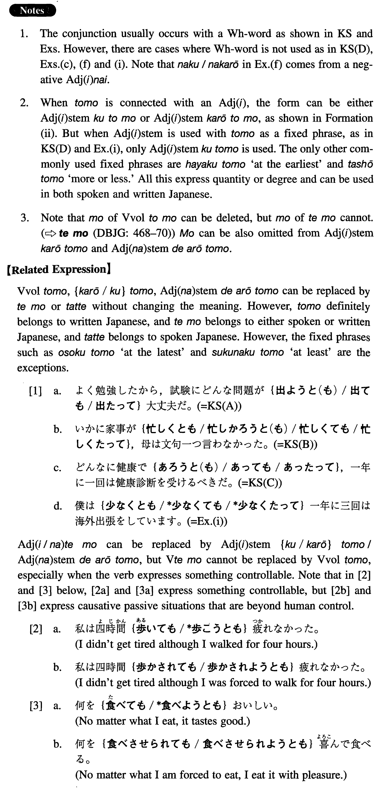

# とも

 
 
 
 

## Summary

<table><tr>   <td>Summary</td>   <td>A conjunction in written Japanese that is used to express a concession.</td></tr><tr>   <td>English</td>   <td>No matter ~ may be; even if; at ~ -est</td></tr><tr>   <td>Part of speech</td>   <td>Conjunction (used in writing and formal speech only)</td></tr><tr>   <td>Related expression</td>   <td>ても; たって</td></tr></table>

## Formation

<table class="table"><tbody><tr class="tr head"><td class="td">(i) Wh-word+Vvol</td><td class="td">とも</td><td class="td"></td></tr><tr class="tr"><td class="td"></td><td class="td">どこへ行こうとも</td><td class="td">No matter where someone may go</td></tr><tr class="tr"><td class="td"></td><td class="td">何を食べようとも</td><td class="td">No matter what someone may eat</td></tr><tr class="tr"><td class="td"></td><td class="td">何があるうとも</td><td class="td">No matter what may happen</td></tr><tr class="tr head"><td class="td">(ii) Wh-word+Adjective い stem</td><td class="td">{く/かろう}とも</td><td class="td"></td></tr><tr class="tr"><td class="td"></td><td class="td">{いかに/どんなに}難し{く/かろう}とも</td><td class="td">No matter how difficult something may be</td></tr><tr class="tr head"><td class="td">(iii) Wh-word+Adjective な stem </td><td class="td">であろうとも</td><td class="td"></td></tr><tr class="tr"><td class="td"></td><td class="td">{いかに/どんなに}好きであろうとも</td><td class="td">No matter how much someone likes something</td></tr><tr class="tr head"><td class="td">(iv) Adjective い stem</td><td class="td">くとも</td><td class="td"></td></tr><tr class="tr"><td class="td"></td><td class="td">早くとも</td><td class="td">At the earliest</td></tr></tbody></table>

## Example Sentences

<table><tr>   <td>よく勉強したから、試験にどんな問題が出ようとも大丈夫だ。</td>   <td>Since I studied hard I feel confident no matter what problem shows up on the test.</td></tr><tr>   <td>いかに家事が忙し{く/かろう}とも母は文句一つ言わなかった。</td>   <td>No matter how busy she was with housekeeping, my mother never uttered a single complaint.</td></tr><tr>   <td>どんなに健康であろうとも、一年に一回は健康診断を受けるべきだ。</td>   <td>No matter how healthy you are, you should have a check-up once a year.</td></tr><tr>   <td>このプロジェクトは遅くとも来年の四月には完了するだろう。</td>   <td>At the latest, this project will be complete in April of next year.</td></tr><tr>   <td>父は何が起きようともいつも平然としている。</td>   <td>My father is always very calm no matter what is impending.</td></tr><tr>   <td>私は世界のどこに住もうとも一向に構わない。</td>   <td>I do not care at all where in the world I live.</td></tr><tr>   <td>万一失敗しようとも、簡単に諦めてはいけない。</td>   <td>Even if by any chance you fail you shouldn't give up easily.</td></tr><tr>   <td>いかに頭がよ{く/かろう}とも、努力しなければいい仕事は出来ない。</td>   <td>No matter how bright you may be, you cannot do a good job unless you make an effort.</td></tr><tr>   <td>どんなに品物が安{く/かろう}とも、質が悪ければ金を捨てることになる。</td>   <td>No matter how cheap merchandise may be, if the quality is poor, you will end up throwing away money.</td></tr><tr>   <td>金が十分な{く/かろう}とも、生活を楽しむことは出来るはずだ。</td>   <td>Even without enough money we should be able to enjoy life.</td></tr><tr>   <td>どんなに運動が好きであろうとも、運動のやり過ぎはかえって悪い。</td>   <td>No matter how much one may like exercise, too much of it is bad.</td></tr><tr>   <td>この手紙はあなたがいくら読みたくとも読ませるわけにはいかない。</td>   <td>I cannot let you read this letter, no matter how much you want to read it.</td></tr><tr>   <td>僕は少なくとも、一年に三回は海外出張をしています。</td>   <td>I make business trips abroad at least three times a year.</td></tr></table>

## Grammar Book Page

