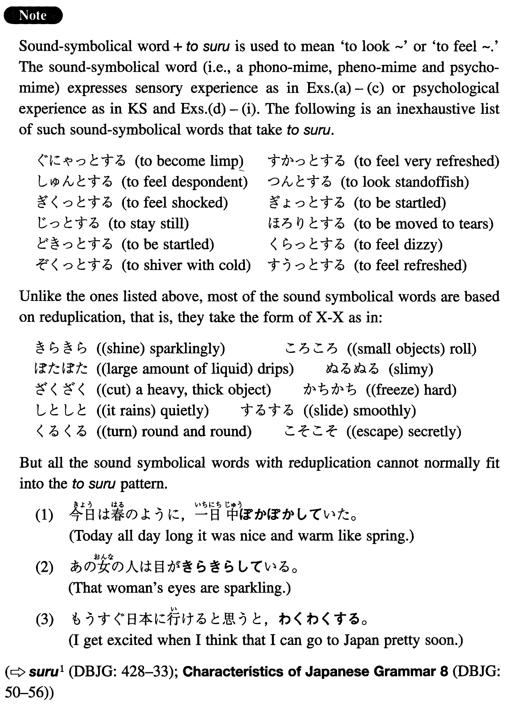

# とする (2)

[1. Summary](#summary) 
[2. Formation](#formation) 
[3. Example Sentences](#example-sentences) 
 

## Summary

<table><tr>   <td>Summary</td>   <td>To have a sensory or psychological experience.</td></tr><tr>   <td>English</td>   <td>Feel ~; look ~</td></tr><tr>   <td>Part of speech</td>   <td>Phrase</td></tr></table>

## Formation

<table class="table"><tbody><tr class="tr head"><td class="td">Sound Symbolism</td><td class="td">とする</td><td class="td"></td></tr><tr class="tr"><td class="td"></td><td class="td">つるっとする</td><td class="td">Someone feels something slippery</td></tr><tr class="tr"><td class="td"></td><td class="td">ほっとする</td><td class="td">Someone feels relieved</td></tr></tbody></table>

## Example Sentences

<table><tr>   <td>あの人はちょっとしたことでかっとする。</td>   <td>That person flares up at the slightest provocation.</td></tr><tr>   <td>あの男の人は目がギョロリとしている。</td>   <td>He has goggling eyes.</td></tr><tr>   <td>姉は足がすらっとしている。</td>   <td>My older sister has slender legs.</td></tr><tr>   <td>今日の天気はからっとしていて、気持ちがいい。</td>   <td>It is nice and dry today.</td></tr><tr>   <td>昔の恋人を東京駅で見かけて、はっとした。</td>   <td>I was taken aback when I saw my old girlfriend at Tokyo station.</td></tr><tr>   <td>ジョンは遅刻して先生に叱られたのに、けろっとしていた。</td>   <td>John was scolded by his teacher when he came in late, but he didn't show any sense of wrong doing.</td></tr><tr>   <td>日本語の試験が思ったよりよく出来たのでほっとした。</td>   <td>I felt relieved because I did better in a Japanese test than I expected.</td></tr><tr>   <td>部長は部下に反対された時、むっとした。</td>   <td>The department chief looked offended when he was opposed by his subordinate.</td></tr><tr>   <td>難しいと思っていた日本語の試験が易しかったのでほっとした。</td>   <td>The Japanese test which I thought would be difficult turned out to be easy, and I felt relieved.</td></tr><tr>   <td>休みの日は何もしないで、ぼうっとしているのが好きです。</td>   <td>On my days off I like to do nothing and to be completely laid back.</td></tr></table>

## Grammar Book Page

