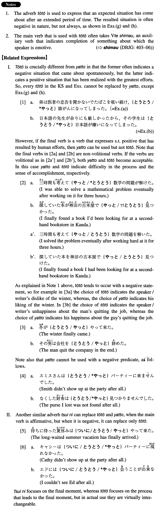

# とうとう

[1. Summary](#summary) 
[2. Example Sentences](#example-sentences) 
[3. Grammar Book Page](#grammar-book-page) 

## Summary

<table><tr>   <td>Summary</td>   <td>An adverb that is used to express the eventual arrival of an expected situation.</td></tr><tr>   <td>Equivalent</td>   <td>Finally; at (long) last; eventually; in the end; after all</td></tr><tr>   <td>Part of speech</td>   <td>Adverb</td></tr><tr>   <td>Related expression</td>   <td>やっと; ついに</td></tr></table>

## Example Sentences

<table><tr>   <td>朝から降りそうだった雨がとうとう降り出した。</td>   <td>It's been threatening to rain since the morning and finally it started to rain. (literally: The rain which threatened to fall from the morning finally started to fall.)</td></tr><tr>   <td>弟は医者の忠告を聞かないで煙草を吸い続け、とうとう肺がんになってしまった。</td>   <td>My younger brother didn't take his doctor's advice and kept smoking until he finally got lung cancer.</td></tr><tr>   <td>日本語の先生が余りにも厳しかったから、その学生はとうとう日本語が嫌いになってしまった。</td>   <td>Because his Japanese instructor was so strict the student eventually came to hate the Japanese language.</td></tr><tr>   <td>その数学の問題は何時間かけても解けなかったので、とうとう諦めてしまった。</td>   <td>I wasn't able to solve the mathematical problem after spending many hours on it, so I finally gave up.</td></tr><tr>   <td>ビルは妻との関係がだんだん悪化し、とうとう別れてしまった。</td>   <td>Bill's relationship with his wife gradually deteriorated and they eventually separated.</td></tr><tr>   <td>この会社で働くのもとうとう今日が最後となった。</td>   <td>At long last this is the last day I work at this company.</td></tr><tr>   <td>十五年も飼っていた猫がとうとう老衰で死んでしまった。</td>   <td>The cat we had kept for 15 years finally died of old age.</td></tr><tr>   <td>とうとう博士論文を書いてしまった。</td>   <td>At long last I finished writing a Ph.D. dissertation.</td></tr><tr>   <td>私達の結婚の日がとうとうやって来た。</td>   <td>Our wedding day has finally come.</td></tr></table>

## Grammar Book Page

