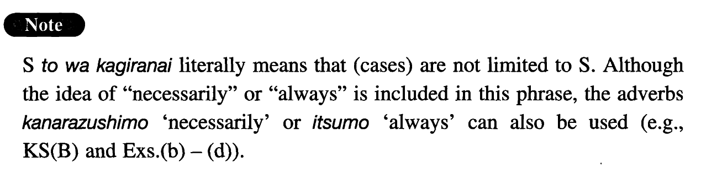

# とは限らない

[1. Summary](#summary) 
[2. Formation](#formation) 
[3. Example Sentences](#example-sentences) 
 

## Summary

<table><tr>   <td>Summary</td>   <td>A phrase which expresses the idea \"not necessarily\".</td></tr><tr>   <td>English</td>   <td>Not always; not necessarily</td></tr><tr>   <td>Part of speech</td>   <td>Phrase</td></tr></table>

## Formation

<table class="table"><tbody><tr class="tr head"><td class="td">Sinformal</td><td class="td">とは限らない</td><td class="td"></td></tr><tr class="tr"><td class="td"></td><td class="td">よくなるとは限らない</td><td class="td">Someone will not necessarily get well</td></tr></tbody></table>

## Example Sentences

<table><tr>   <td>体の弱い人が早く死ぬとは限らない。</td>   <td>Frail people do not necessarily die young.</td></tr><tr>   <td>高い物がいつも・必ずしも安い物よりいいとは限らない。</td>   <td>Expensive things are not always / necessarily better than inexpensive ones.</td></tr><tr>   <td>日本に長く住んでいるから（と言って）日本語が上手だとは限らない。</td>   <td>It is not necessarily the case that people are good at Japanese because they have lived in Japan a long time.</td></tr><tr>   <td>日本に行っても日本語が上手になるとは限らない。</td>   <td>You will not necessarily become good at Japanese even if you go to Japan.</td></tr><tr>   <td>お金があれば幸福になれるとは限らない。</td>   <td>You will not (literally: cannot) necessarily be happy if you have money.</td></tr><tr>   <td>漫画が子供の教育にとって有害だとは限らない。</td>   <td>Comics are not necessarily harmful to children's education.</td></tr><tr>   <td>日本人の使う日本語がいつも正しいとは限らない。</td>   <td>The Japanese used by Japanese people is not always correct.</td></tr><tr>   <td>スポーツ選手が必ずしも健康だとは限らない。</td>   <td>Athletes are not necessarily healthy.</td></tr><tr>   <td>技術の進歩が必ずしも我々に繁栄をもたらすとは限らない。</td>   <td>Progress in technology does not necessarily bring us prosperity.</td></tr><tr>   <td>先生がそう言ったからと言ってそれが正しいとは限らない。</td>   <td>It is not necessarily correct just because the teacher said so.</td></tr><tr>   <td>薬を飲んだからと言ってよくなるとは限らない。</td>   <td>You do not necessarily get better because you take medicine.</td></tr><tr>   <td>頭がよくても人生に成功するとは限らない。</td>   <td>You do not necessarily succeed in your life even if you are smart.</td></tr><tr>   <td>実力があっても失業しないとは限らない。</td>   <td>It is not necessarily true that you won't lose your job even if you have ability.</td></tr><tr>   <td>悪い家庭環境に育てば必ず悪い子供になるとは限らない。</td>   <td>It is not necessarily true that children become bad if they grow up in a bad family environment.</td></tr><tr>   <td>時間が沢山あればいい論文が書けるとは限らない。</td>   <td>It is not necessarily true that you can write a good paper if you have a lot of time.</td></tr></table>

## Grammar Book Page

