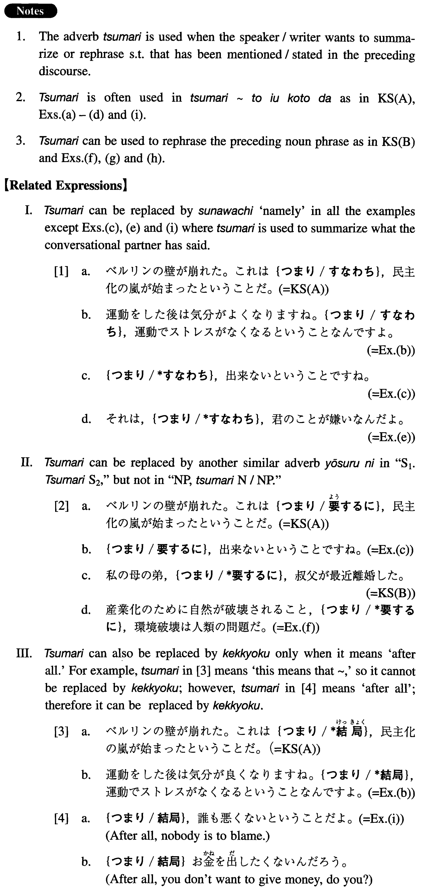

# つまり

[1. Summary](#summary) 
[2. Formation](#formation) 
[3. Example Sentences](#example-sentences) 
[4. Grammar Book Page](#grammar-book-page) 

## Summary

<table><tr>   <td>Summary</td>   <td>An adverb that is used to summarise or rephrase what has been mentioned/stated in the preceding context.</td></tr><tr>   <td>English</td>   <td>That is (to say); namely; in short; to sum up; in other words; after all; that means</td></tr><tr>   <td>Part of speech</td>   <td>Adverb</td></tr><tr>   <td>Related expression</td>   <td>結局; すなわち; ようするに</td></tr></table>

## Formation

<table class="table"><tbody><tr class="tr head"><td class="td">(i) Sentence 1 (Sentence2…) </td><td class="td">つまり Sentence Noun</td><td class="td"></td></tr><tr class="tr"><td class="td"></td><td class="td">金がない。つまり、貧乏なんです。</td><td class="td">I don’t have money. In other words, I’m poor</td></tr><tr class="tr head"><td class="td">(ii) Noun Phrase</td><td class="td">つまり Noun/Noun Phrase</td><td class="td"></td></tr><tr class="tr"><td class="td"></td><td class="td">母の姉の子供、つまり、私のいとこ</td><td class="td">The child of my mother’s older sister, my cousin, that is</td></tr></tbody></table>

## Example Sentences

<table><tr>   <td>ベルリンの壁が崩れた。これはつまり、民主化の嵐が始まったということだ。</td>   <td>The Berlin Wall fell apart. This means that the storm of democratization has started.</td></tr><tr>   <td>私の母の弟、つまり、叔父が最近離婚した。</td>   <td>My mother's younger brother, that is to say, my uncle, has recently divorced.</td></tr><tr>   <td>アメリカに一年間一人で出張するんです。つまり、単身赴任ということですよ。</td>   <td>I'm going without my family to work for the company in America for one year. In other words, I'm becoming a tanshin-funin worker.</td></tr><tr>   <td>運動をした後は気分がよくなりますね。つまり、運動でストレスがなくなるということなんですよ。</td>   <td>You feel good after exercise, right? That means, stress is eliminated by exercise.</td></tr><tr>   <td>A：部長、このプロジェクトは出来ますか。B:そうだね。いいプロジェクトだと思うけど、予算がどうもねえ。A：つまり、出来ないということですね。</td>   <td>A: Chief, can we do this project? B: Well, I think it's a fine project, but you know how the budget is. A: In short, we cannot do it, right?</td></tr><tr>   <td>日本の父親は子供がまだ寝ている時に家を出て、子供達が寝てから家に帰って来る。つまり、父親不在ということだ。</td>   <td>Japanese fathers leave home while their children are still asleep and come home after they have gone to sleep. This is, in short, an absence of fathers.</td></tr><tr>   <td>A：彼女、僕が会いに行っても、あまり話してくれないんですよ。B:それは、つまり、君のことが嫌いなんだよ。</td>   <td>A: I go to see her, but she doesn't talk much to me, you know. B: That means, she doesn't like you.</td></tr><tr>   <td>産業化のために自然が破壊されること、つまり、環境破壊は人類の問題だ。</td>   <td>The destruction of nature by industrialization, that is to say, environmental destruction, is a problem of mankind.</td></tr><tr>   <td>私の母の妹の娘、つまり、私のいとこが来週バンコクから来ます。</td>   <td>The daughter of my mother's younger sister, my cousin, that is, is coming from Bangkok next week.</td></tr><tr>   <td>女性を女性だからといって差別すること、つまり、性差別の問題はどこへ行ってもある。</td>   <td>To discriminate against a woman simply because she is a woman, in short, sexual discrimination, exists no matter where you go.</td></tr><tr>   <td>つまり、誰も悪くないということだ。</td>   <td>Nobody is to blame, after all.</td></tr></table>

## Grammar Book Page

