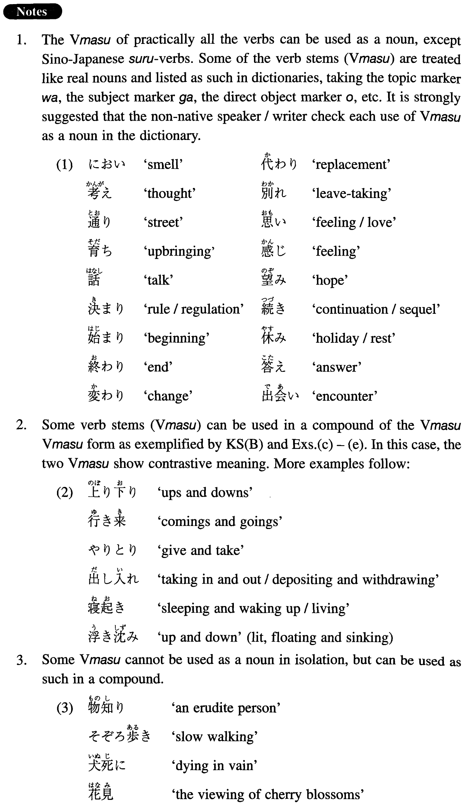

# Vmasu as a Noun

[1. Summary](#summary) 
[2. Example Sentences](#example-sentences) 
[3. Grammar Book Page](#grammar-book-page) 

## Summary

<table><tr>   <td>Summary</td>   <td>Vます used as a regular noun.</td></tr><tr>   <td>Part of speech</td>   <td>Noun</td></tr></table>

## Example Sentences

<table><tr>   <td>彼はまだ若いから、考えが浅い。</td>   <td>Because he is still young, his thoughts are shallow.</td></tr><tr>   <td>日本語は、話すのは比較的易しいが、読み書きは難しい。</td>   <td>It is relatively easy to speak Japanese, but reading and writing are hard.</td></tr><tr>   <td>終わりがよければ、全体がよくなる。</td>   <td>If the end is alright, all becomes good.</td></tr><tr>   <td>遊びのない生活はつまらない。</td>   <td>Life without play is boring.</td></tr><tr>   <td>お金の貸し借りはしない方がいい。</td>   <td>It is better not to borrow or lend money.</td></tr><tr>   <td>東京ディズニーランドに車で行って来たが、行き帰りに五時間以上もかかった。</td>   <td>We went to Tokyo Disneyland but it took more than five hours to get there and back.</td></tr><tr>   <td>人生は勝ち負けの連続だ。</td>   <td>Life is a series of wins and losses.</td></tr></table>

## Grammar Book Page

