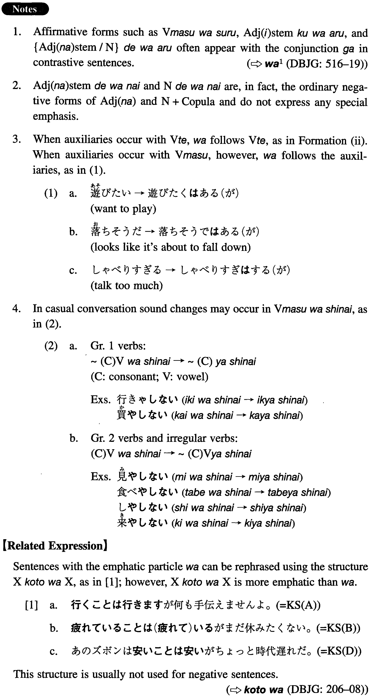

# は

[1. Summary](#summary) 
[2. Formation](#formation) 
[3. Example Sentences](#example-sentences) 
[4. Grammar Book Page](#grammar-book-page) 

## Summary

<table><tr>   <td>Summary</td>   <td>A particle which emphatically affirms or negates the proposition represented by the preceding verbal and other related elements.</td></tr><tr>   <td>Equivalent</td>   <td>[emphatic] {do/does/did} V; will V; {am/are/is/was/were} Adjective/Noun; (not) V/Adjective/Noun</td></tr><tr>   <td>Part of speech</td>   <td>Particle</td></tr><tr>   <td>Related expression</td>   <td>ことは</td></tr></table>

## Formation

<table class="table"><tbody><tr class="tr head"><td class="td">(i) Vます</td><td class="td">は{する(が)/しない}</td><td class="td"></td></tr><tr class="tr"><td class="td"></td><td class="td">話しは{する(が)/しない}</td><td class="td">Someone <em>will</em> tell (but)/will <em>not</em> tell</td></tr><tr class="tr head"><td class="td">(ii) Vて</td><td class="td">は{いる(が)/ いない}</td><td class="td">{みる(が)/みない}, etc.</td></tr><tr class="tr"><td class="td"></td><td class="td">食べては{いる(が)/ いない}</td><td class="td">Someone <em>is</em> eating (but)/is <em>not</em> eating</td></tr><tr class="tr head"><td class="td">(iii) Adjective い stem</td><td class="td">くは{ある (が)/ ない}</td><td class="td"></td></tr><tr class="tr"><td class="td"></td><td class="td">面白くは{ある (が)/ ない}</td><td class="td">Something <em>is</em> interesting (but)/is <em>not</em> interesting</td></tr><tr class="tr head"><td class="td">(iv) Adjective な stem/Noun</td><td class="td">では{ある (が)/ ない}</td><td class="td"></td></tr><tr class="tr"><td class="td"></td><td class="td">便利では{ある (が)/ ない}</td><td class="td">Something <em>is</em> convenient (but)/is <em>not</em> convenient</td></tr><tr class="tr"><td class="td"></td><td class="td">学生では{ある (が)/ ない}</td><td class="td">Someone <em>is</em> a student (but)/is <em>not</em> a student</td></tr></tbody></table>

## Example Sentences

<table><tr>   <td>行きはしますが、何も手伝えませんよ。</td>   <td>I am going (there) but I cannot help you, all right?</td></tr><tr>   <td>疲れてはいるが、まだ休みたくない。</td>   <td>I <em>am</em> tired but I don't want to take a break yet.</td></tr><tr>   <td>あの男には説明しても分かりはしない。</td>   <td>That guy would <em>not</em> understand even if you explained it to him.</td></tr><tr>   <td>あのズボンは安くはあるが、ちょっと時代遅れだ。</td>   <td>Those pants <em>are</em> cheap but they are a little too old-fashioned.</td></tr><tr>   <td>この本は内容を考えれば決して高くはない。</td>   <td>This book is <em>not</em> expensive at all when you consider its content.</td></tr><tr>   <td>酒は飲みはするが、それほど好きではない。</td>   <td>I <em>do</em> drink but don't like it very much.</td></tr><tr>   <td>彼は日本語を読めはするが、話せはしない。</td>   <td>He <em>can</em> read Japanese but cannot speak it.</td></tr><tr>   <td>彼女はベッドに横になってはいるが、目は開いている。</td>   <td>She <em>is</em> lying in bed but her eyes are open.</td></tr><tr>   <td>試験を受けてはみるが、通る自信は全然ない。</td>   <td>I <em>will</em> take the exam (and see what will happen), but I have no confidence that I will pass it.</td></tr><tr>   <td>彼は何を言っても聞きはしない。</td>   <td>He does <em>not</em> listen, no matter what we tell him.</td></tr><tr>   <td>この花瓶は高くはあるが、それだけの値打ちはある。</td>   <td>This vase <em>is</em> expensive but it is valuable to that extent.</td></tr><tr>   <td>この問題はよく考えれば難しくはないはずだ。</td>   <td>If you think carefully, this problem should <em>not</em> be difficult.</td></tr><tr>   <td>あの男は優秀ではあったが、不正なことをしたので首になった。</td>   <td>He <em>was</em> smart but he was fired because he did something illegal.</td></tr><tr>   <td>彼は日本人ではあるが、あまり日本語を話せない。</td>   <td>He <em>is</em> Japanese but cannot speak Japanese well.</td></tr></table>

## Grammar Book Page

