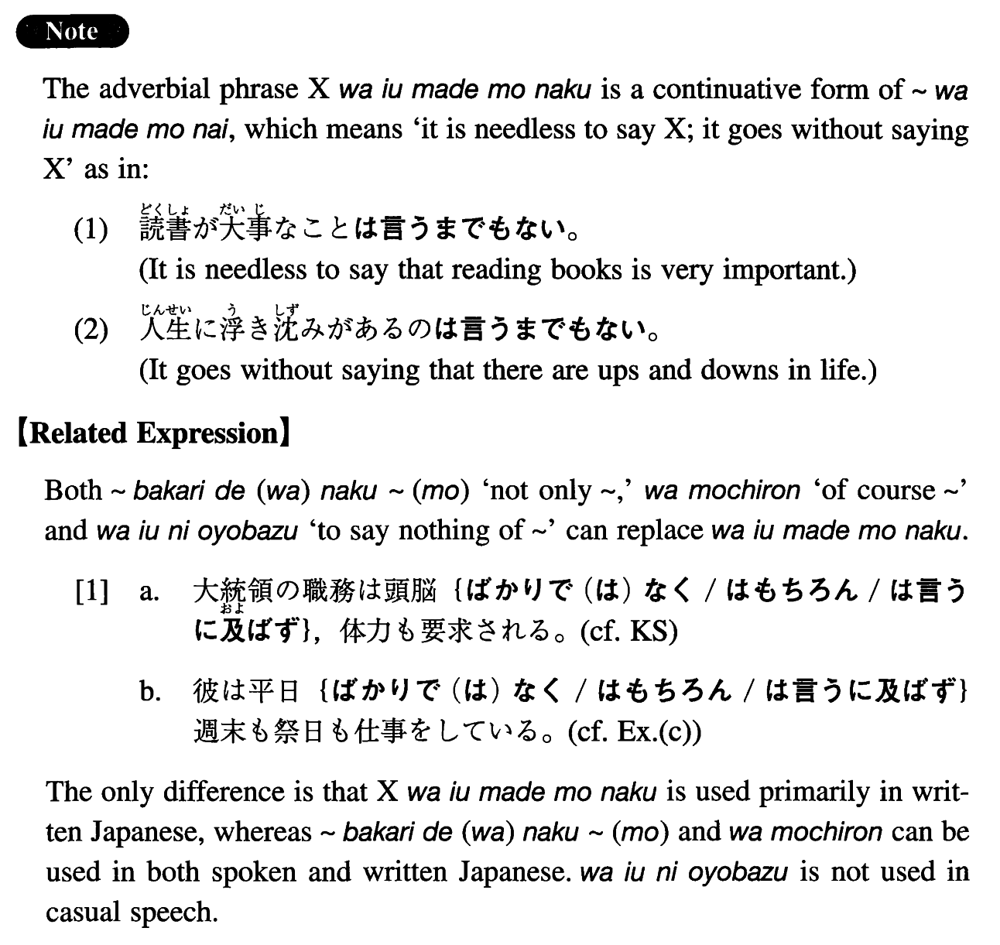

# は言うまでもなく

[1. Summary](#summary) 
[2. Formation](#formation) 
[3. Example Sentences](#example-sentences) 
[4. Grammar Book Page](#grammar-book-page) 

## Summary

<table><tr>   <td>Summary</td>   <td>An adverbial phrase that conveys the meaning of 'not to speak of something/someone'.</td></tr><tr>   <td>Equivalent</td>   <td>Not to speak of; let alone; not to mention; to say nothing of</td></tr><tr>   <td>Part of speech</td>   <td>Adverbial Phrase (used in writing and formal speech only)</td></tr><tr>   <td>Related expression</td>   <td>ばかりで(は)なく~(も); は言うに及ばず; はもちろん</td></tr></table>

## Formation

<table class="table"><tbody><tr class="tr head"><td class="td">Noun</td><td class="td">は言うまでもなく</td><td class="td"></td></tr><tr class="tr"><td class="td"></td><td class="td">スポーツは言うまでもなく</td><td class="td">Not to speak of sports</td></tr></tbody></table>

## Example Sentences

<table><tr>   <td>大統領の職務は頭脳は言うまでもなく、体力も要求される。</td>   <td>The duty of the presidency requires physical strength, not to mention brains.</td></tr><tr>   <td>日本は土地は言うまでもなく、家も非常に高い。</td>   <td>In Japan houses are very expensive, not to mention land.</td></tr><tr>   <td>この大学は教育内容は言うまでもなく、設備も抜群に優れている。</td>   <td>This university excels in facilities, to say nothing of educational programs.</td></tr><tr>   <td>彼は平日は言うまでもなく、週末や祭日も仕事をしている。</td>   <td>He is working even on weekends and holidays, not to speak of weekdays.</td></tr><tr>   <td>ジュリアンは菜食主義者なので、牛肉は言うまでもなく、魚も鶏肉も食べない。</td>   <td>Julian is a vegetarian, so he doesn't eat fish or chicken, let alone beef.</td></tr><tr>   <td>あの学生は漢字は言うまでもなく、平仮名、片仮名さえ知らない。</td>   <td>That student doesn't know even hiragana and katakana, let alone kanji.</td></tr></table>

## Grammar Book Page

