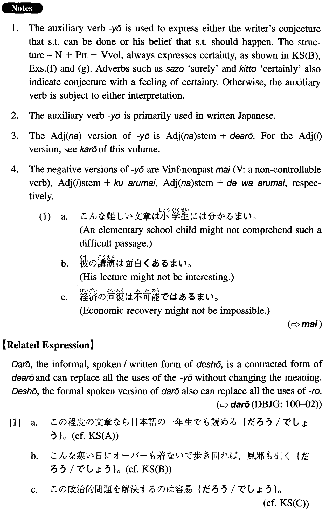

# よう (2)

[1. Summary](#summary) 
[2. Formation](#formation) 
[3. Example Sentences](#example-sentences) 
[4. Grammar Book Page](#grammar-book-page) 

## Summary

<table><tr>   <td>Summary</td>   <td>An auxiliary verb that expresses the writer's conjecture about some potentiality or his certainty about a given state of affairs.</td></tr><tr>   <td>English</td>   <td>Probably; likely; must be; should; ought; naturally</td></tr><tr>   <td>Part of speech</td>   <td>Auxiliary (used in writing and formal speech only)</td></tr><tr>   <td>Related expression</td>   <td>だろう; でしょう</td></tr></table>

## Formation

<table class="table"><tbody><tr class="tr head"><td class="td">(i) Vvolitional</td><td class="td">V: non-controllable verb</td><td class="td"></td></tr><tr class="tr"><td class="td"></td><td class="td">書けよう</td><td class="td">Someome (probably) can write something</td></tr><tr class="tr"><td class="td"></td><td class="td">出来よう</td><td class="td">Someone (probably) can do something</td></tr><tr class="tr head"><td class="td">(ii) Noun+particle</td><td class="td">V: non-controllable verb</td><td class="td"></td></tr><tr class="tr"><td class="td"></td><td class="td">目も覚めよう</td><td class="td">It is natural that one wakes up</td></tr><tr class="tr"><td class="td"></td><td class="td">日本語が分かろう</td><td class="td">Someone probably understands Japanese</td></tr><tr class="tr head"><td class="td">(iii) Adjective な stem</td><td class="td">であろう</td><td class="td"></td></tr><tr class="tr"><td class="td"></td><td class="td">便利であろう</td><td class="td">Something is probably/must be convenient</td></tr></tbody></table>

## Example Sentences

<table><tr>   <td>この程度の文章なら日本語の一年生でも読めよう。</td>   <td>Even the first year students of Japanese (probably) can read a passage of this level.</td></tr><tr>   <td>こんな寒い日にオーバーも着ないで歩き回れば、風邪も引こう。</td>   <td>If you walk around without wearing an overcoat on such a cold day, it is a matter of course that you will catch a cold.</td></tr><tr>   <td>この政治的問題を解決するのは容易であろう。</td>   <td>It is probably/must be easy to solve this political problem</td></tr><tr>   <td>この問題については色々政治的解決が考えられよう。</td>   <td>Regarding this problem, all sorts of political solutions can (probably) be considered.</td></tr><tr>   <td>このピアノソナタだったら子供にも弾けよう。</td>   <td>Even a child should be able to play this piano sonata.</td></tr><tr>   <td>この報告書は来週の金曜日までには書けよう。</td>   <td>We should be able to write this report by next Friday.</td></tr><tr>   <td>あのタワーに上れば、町全体がよく見えよう。</td>   <td>If you go up that tower, you should be able to see the entire city.</td></tr><tr>   <td>米ソ関係の改善で、世界の平和は維持出来よう。</td>   <td>With the improvement of U.S.-Russia relations, it is likely that world peace can be maintained.</td></tr><tr>   <td>あんなにひどいことをされたら、腹も立とう。</td>   <td>If you are treated as badly as that you naturally get mad.</td></tr><tr>   <td>あれだけむちゃくちゃに働けば、病気にもなろう。</td>   <td>If you work as crazy as that, you will naturally get ill.</td></tr><tr>   <td>この辺りでは夜の一人歩きは危険であろう。</td>   <td>In this neighbourhood it is probably/must be dangerous to walk alone at night.</td></tr></table>

## Grammar Book Page

