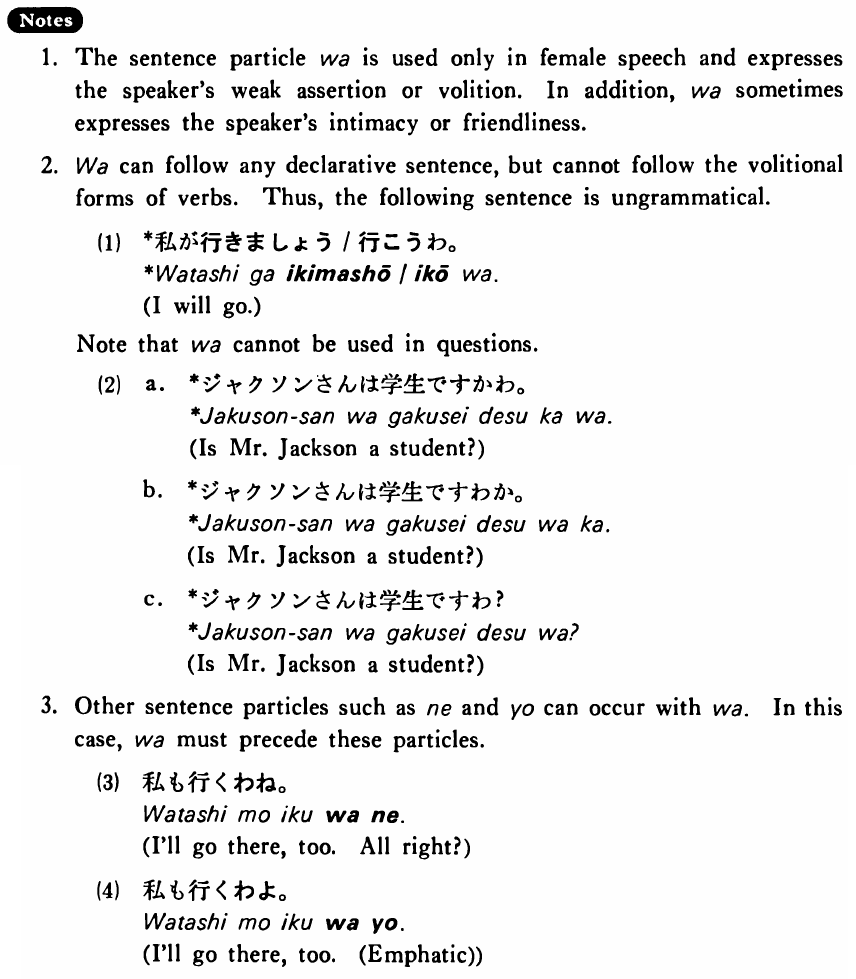

# わ (2)

[1. Summary](#summary) 
[2. Example Sentences](#example-sentences) 
[3. Explanation](#explanation) 
[4. Grammar Book Page](#grammar-book-page) 

## Summary

<table><tr>   <td>Summary</td>   <td>A sentence final particle used in weak assertive or volitional sentences by a female speaker.</td></tr><tr>   <td>Part of speech</td>   <td>Particle</td></tr></table>

## Example Sentences

<table><tr>   <td>私も明日のパーティーに行くわ。</td>   <td>I'll go to tomorrow's party, too.</td></tr><tr>   <td>大木さんはもう帰りましたわ。</td>   <td>Mr. Ooki has already gone home.</td></tr><tr>   <td>久子はまだ学生ですわ。</td>   <td>Hisako is still a student.</td></tr><tr>   <td>この部屋は小さいわ。</td>   <td>This room is small.</td></tr></table>

## Explanation

1. The sentence particle わ is used only in female speech and expresses the speaker's weak assertion or volition. In addition, わ sometimes expresses the speaker's intimacy or friendliness.
  
2. わ can follow any declarative sentence, but cannot follow the volitional forms of verbs. Thus, the following sentence is ungrammatical.
  <ul>(1) <li>*私が行きましょう/行こうわ。</li> <li>I will go.</li> </ul>  
Note that わ cannot be used in questions.
  <ul>(2)  <li>a. *ジャクソンさんは学生ですかわ。</li> <li>Is Mr. Jackson a student?</li> 

 <li>b. *ジャクソンさんは学生ですわか。</li> <li>Is Mr. Jackson a student?</li> 

 <li>c. *ジャクソンさんは学生ですわ？</li> <li>Is Mr. Jackson a student?</li> </ul>  
3. Other sentence particles such as ね and よ can occur with くぁ. In this case, わ must precede these particles.
  <ul>(3) <li>私も行くわね。</li> <li>I'll go there, too. All right?</li> </ul>  <ul>(4) <li>私も行くわよ。</li> <li>I'll go there, too. [Emphatic]</li> </ul>

## Grammar Book Page

