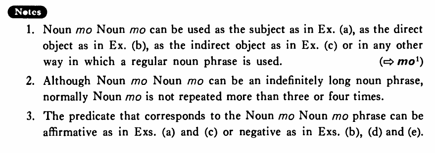

# も~も

[1. Summary](#summary) 
[2. Formation](#formation) 
[3. Example Sentences](#example-sentences) 
[4. Explanation](#explanation) 
[5. Grammar Book Page](#grammar-book-page) 

## Summary

<table><tr>   <td>Summary</td>   <td>The repeated use of a particle meaning ‘also’ to list elements belonging to the same part of speech.</td></tr><tr>   <td>English</td>   <td>Both ~ and ~; neither ~ nor</td></tr><tr>   <td>Part of speech</td>   <td>Structure</td></tr></table>

## Formation

<table class="table"> <tbody><tr class="tr head"> <td class="td">(i)  </td> <td class="td">N(Prt)もN(Prt)もN(Prt)も</td> <td class="td">&nbsp;</td> </tr> <tr class="tr"> <td class="td">&nbsp;</td> <td class="td">&nbsp;</td> <td class="td">Both    teachers and students</td> </tr> <tr class="tr head"> <td class="td">(ii)  </td> <td class="td">AdjいstemくもAdjいstemくも Negative</td> <td class="td">&nbsp;</td> </tr> <tr class="tr"> <td class="td">&nbsp;</td> <td class="td">&nbsp;</td> <td class="td">Something    is neither big nor small</td> </tr> <tr class="tr head"> <td class="td">(iii)  </td> <td class="td">{Adjなstem /N} でも {Adjなstem/N} でも Negative</td> <td class="td">&nbsp;</td> </tr> <tr class="tr"> <td class="td">&nbsp;</td> <td class="td">便利でも不便でもない </td> <td class="td">Something    is neither convenient nor inconvenient</td> </tr> <tr class="tr"> <td class="td">&nbsp;</td> <td class="td">先生でも学生でもない </td> <td class="td">Someone    is neether a teacher or a student</td> </tr></tbody></table>

## Example Sentences

<table><tr>   <td>田中さんも中山さんもデパートに勤めている・います。</td>   <td>Both Mr. Tanaka and Mr. Nakayama are working for a department store.</td></tr><tr>   <td>京都へはバスでも電車でも行ける・行けます。</td>   <td>We can go to Kyoto either by both bus or by electric train.</td></tr><tr>   <td>このうちは広くも狭くもない・ありません。</td>   <td>This house is neither big nor small.</td></tr><tr>   <td>日本人もアメリカ人もよく働く。</td>   <td>Both Japanese and Americans work hard.</td></tr><tr>   <td>山川さんは酒も煙草もやりません。</td>   <td>Mr. Yamakawa neither drinks nor smokes.</td></tr><tr>   <td>弟にも妹にも本を買ってやりました。</td>   <td>I bought books for both my younger brother and sister.</td></tr><tr>   <td>和枝は美人でも不美人でもない。</td>   <td>Kazue is neither beautiful nor ugly.</td></tr><tr>   <td>この建物は奇麗でも立派でもありません。</td>   <td>This building is neither pretty nor magnificent.</td></tr></table>

## Explanation

1. NounもNounも can be used as the subject as in Example (a), as the direct object as in Example (b), as the indirect object as in Example (c) or in any other way in which a regular noun phrase is used.
   
(⇨ <a href="#㊦ も">も1</a>)
  
2. Although NounもNounも can be an indefinitely long noun phrase, normally Nounも is not repeated more than three or four times.
  
3. The predicate that corresponds to the NounもNounも phrase can be affirmative as in Examples (a) and (c) or negative as in Examples (b), (d) and (e).

## Grammar Book Page

