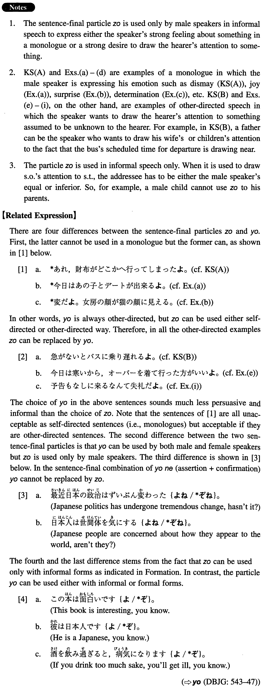

# ぞ

[1. Summary](#summary) 
[2. Formation](#formation) 
[3. Example Sentences](#example-sentences) 
[4. Grammar Book Page](#grammar-book-page) 

## Summary

<table><tr>   <td>Summary</td>   <td>A sentence final particle that emphasises a male speaker's emotion about something in his monologue or his strong desire to draw someone else's attention.</td></tr><tr>   <td>Equivalent</td>   <td>I tell you; I'm telling you; you know</td></tr><tr>   <td>Part of speech</td>   <td>Particle (used in conversation only)</td></tr><tr>   <td>Related expression</td>   <td>よ</td></tr></table>

## Formation

<table class="table"><tbody><tr class="tr head"><td class="td">{V/Adjective い} informal</td><td class="td">ぞ</td><td class="td"></td></tr><tr class="tr"><td class="td"></td><td class="td">食べるぞ。</td><td class="td">Hey, someone is going to eat it</td></tr><tr class="tr"><td class="td"></td><td class="td">食べたぞ。</td><td class="td">Hey, someone ate it</td></tr><tr class="tr"><td class="td"></td><td class="td">まずいぞ。</td><td class="td">Yuck!</td></tr><tr class="tr"><td class="td"></td><td class="td">まずかったぞ。</td><td class="td">It was yucky</td></tr><tr class="tr head"><td class="td">{Adjective な/Noun}</td><td class="td">{だ/だった} ぞ</td><td class="td"></td></tr><tr class="tr"><td class="td"></td><td class="td">元気だぞ。</td><td class="td">Someone is healthy</td></tr><tr class="tr"><td class="td"></td><td class="td">元気だったぞ。</td><td class="td">Someone was healthy</td></tr></tbody></table>

## Example Sentences

<table><tr>   <td>あれ、財布がどこかへ行ってしまったぞ。</td>   <td>Hey, my purse has gone somewhere!</td></tr><tr>   <td>急がないとバスに乗り遅れるぞ。</td>   <td>If you don't hurry, you'll be late for the bus, you know.</td></tr><tr>   <td>今日はあの子とデートが出来るぞ。</td>   <td>Wow! I can date that girl today.</td></tr><tr>   <td>変だぞ。女房の顔が猫の顔に見える。</td>   <td>Strange indeed! My wife's face looks like a cat's face.</td></tr><tr>   <td>今度こそ文部省の奨学金をもらってやるぞ。</td>   <td>By God, this time I will get the Education Ministry's Scholarship.</td></tr><tr>   <td>今日の日本語の試験はうまくいったぞ。</td>   <td>Thank God, today's Japanese exam went well!</td></tr><tr>   <td>今日は寒いから、オーバーを着て行った方がいいぞ。</td>   <td>It's cold today, so you'd better go out with an overcoat on.</td></tr><tr>   <td>このケーキ、食べないなら、俺が食べちゃうぞ。</td>   <td>If you don't eat this cake, I will.</td></tr><tr>   <td>同じ間違いをもう一度したら、許さないぞ。</td>   <td>If you make the same mistake again, I'm not going to forgive you.</td></tr><tr>   <td>おい、この酒、熱くないぞ。</td>   <td>Hey, this sake isn't hot enough!</td></tr><tr>   <td>予告もなしに来るなんて失礼だぞ。</td>   <td>It's rude of you to come here without any advance notice. Do you know that?</td></tr></table>

## Grammar Book Page

