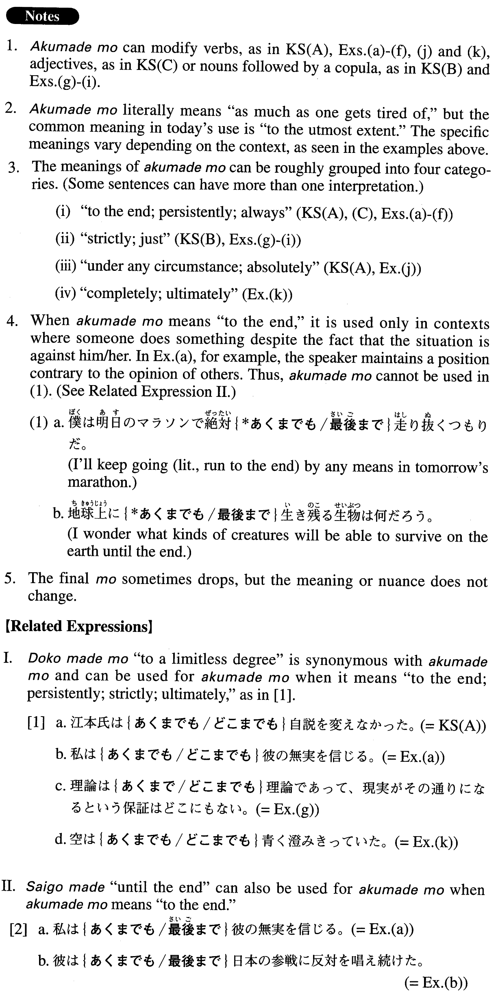

# あくまでも

 
 
 

## Summary

<table><tr>   <td>Summary</td>   <td>An adverb that represents the idea of \"to the utmost degree\".</td></tr><tr>   <td>English</td>   <td>to the end; persistently; insist; strictly; just; under any circumstance; absolutely; never; completely; ultimately</td></tr><tr>   <td>Part of speech</td>   <td>Adverb</td></tr><tr>   <td>Related expression</td>   <td>どこまでも; 最後まで</td></tr></table>

## Example Sentences

<table><tr>   <td>江本氏はあくまでも自説を変えなかった。</td>   <td>Mr. Emoto persistently maintained (literally: didn't change) his opinion.</td></tr><tr>   <td>これはあくまでも小説であって実話ではない。</td>   <td>literally: This is strictly fiction and not a true story.</td></tr><tr>   <td>彼女はあくまでも自分に正直だった。</td>   <td>She was true to herself to the end.</td></tr><tr>   <td>私はあくまでも彼の無実を信じる。</td>   <td>I will believe in his innocence to the end.</td></tr><tr>   <td>彼はあくまでも日本の参戦に反対を唱え続けた。</td>   <td>He kept opposing Japan's entry into the war up to the end.</td></tr><tr>   <td>あくまで一人でやると言うのならあえて手助けはしない。</td>   <td>If you insist on doing it by yourself, I won't venture to assist you.</td></tr><tr>   <td>反乱軍はあくまでも抵抗を続けた。</td>   <td>The insurgent troops continued their resistance to the end.</td></tr><tr>   <td>君がそういう風にあくまでも話し合いを拒否するのならこちらにも考えがある。</td>   <td>If you persistently refuse to have a discussion (with me) like that, I'll make another plan.</td></tr><tr>   <td>ケイトはあくまでも自分の外見にこだわった。</td>   <td>Kate was always particular about the way she looked.</td></tr><tr>   <td>理論はあくまでも理論であって、現実がその通りになるという保証はどこにもない。</td>   <td>Theories are strictly theories; there is no guarantee that reality turns out the way they predict.</td></tr><tr>   <td>ここに書かれた費用はあくまでも目安であり、サービスによっては異なる場合があります。</td>   <td>The cost written here is strictly an estimate. It may differ depending on the service (you choose).</td></tr><tr>   <td>これはあくまでも私の直感なんですが、山田さんは近々この会社を辞めるんじゃないかと思います。</td>   <td>This is just what my sixth sense tells me, but I think Mr. Yamada will quit this company soon.</td></tr><tr>   <td>少しお金を貸していただきたいのですが、家族にはあくまで内緒にしていただきたいのです。</td>   <td>I'd like to borrow some money from you, but I'd appreciate it if you would keep it absolutely secret from my family.</td></tr><tr>   <td>空があくまでも青く澄みきっていた。</td>   <td>The sky was completely blue and clear.</td></tr></table>

## Grammar Book Page

