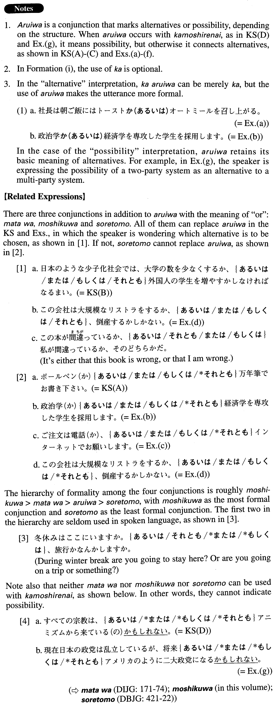

# あるいは

 
 
 
 

## Summary

<table><tr>   <td>Summary</td>   <td>A conjunction that marks alternatives</td></tr><tr>   <td>English</td>   <td>or; either ~ or; perhaps</td></tr><tr>   <td>Part of speech</td>   <td>Conjunction</td></tr><tr>   <td>Related expression</td>   <td>それとも; また; ないし(は)</td></tr></table>

## Formation

<table class="table"><tbody><tr class="tr head"><td class="td">(i) Noun1 (か)、</td><td class="td">&lt;あるいはNoun2</td><td class="td"></td></tr><tr class="tr"><td class="td"></td><td class="td">父(か)、あるいは母</td><td class="td">Either my father or my mother</td></tr><tr class="tr head"><td class="td">(ii) Vinformalか、</td><td class="td">あるいはV2 informalか</td><td class="td"></td></tr><tr class="tr"><td class="td"></td><td class="td">本を読むか、あるいはテニスをするか</td><td class="td">Either reading books or playing tennis</td></tr><tr class="tr head"><td class="td">(iii) {Adjective い informal/Adjectiveな stem}か、</td><td class="td">あるいは{Adjective い informal/Adjective な stem}か</td><td class="td"></td></tr><tr class="tr"><td class="td"></td><td class="td">面白いか、あるいはつまらないか</td><td class="td">Interesting or boring</td></tr><tr class="tr"><td class="td"></td><td class="td">民主的か、あるいは独裁的か</td><td class="td">Democratic or dictorial</td></tr><tr class="tr head"><td class="td">(iv) あるいは</td><td class="td">{Verb/Adjective い} informal(の)かもしれない</td><td class="td"></td></tr><tr class="tr"><td class="td"></td><td class="td">あるいは{行く/行った}(の)かもしれない</td><td class="td">Someone perhaps will go/went there</td></tr><tr class="tr"><td class="td"></td><td class="td">あるいは{面白い/面白かった}(の)かもしれない</td><td class="td">Something is/was perhaps interesting</td></tr><tr class="tr head"><td class="td">(v) あるいは{Adjectiveな stem/Noun}</td><td class="td">{Ø/だった(の)}かもしれ</td><td class="td"></td></tr><tr class="tr"><td class="td"></td><td class="td">あるいは{元気/元気だった(の)}かもしれない</td><td class="td">Someone is/was perhaps healthy</td></tr><tr class="tr"><td class="td"></td><td class="td">あるいは{先生/先生だった(の)}かもしれない</td><td class="td">Someone is/was perhaps a teacher</td></tr></tbody></table>

## Example Sentences

<table><tr>   <td>ボールペン(か)あるいは万年筆でお書き下さい。</td>   <td>Please write either with a ballpoint pen or a fountain pen.</td></tr><tr>   <td>日本のような少子化社会では、大学の数を少なくするか、あるいは外国人の学生を増やすかしなければなるまい。</td>   <td>In a society like Japan where the number of children is decreasing, we may have to either reduce the number of colleges or increase the number of foreign students.</td></tr><tr>   <td>性格が明るいか、あるいは暗いかによって、人生は非常に変わってくる。</td>   <td>Depending on whether someone's personality is cheerful or gloomy, his or her life will change dramatically.</td></tr><tr>   <td>すべての宗教は、あるいはアニミズムから来ている（の）かもしれない。</td>   <td>Perhaps all religions originate from animism.</td></tr><tr>   <td>社長は朝ご飯にはトーストかあるいはオートミールを召し上がる。</td>   <td>For breakfast, the company president has either toast or oatmeal.</td></tr><tr>   <td>政治学あるいは経済学を専攻した学生を採用します。</td>   <td>We will hire a student who has majored in either political science or economics.</td></tr><tr>   <td>ご注文は電話か、あるいはインターネットでお願いします。</td>   <td>Please place your order either by phone or by Internet.</td></tr><tr>   <td>この会社は大規模なリストラをするか、あるいは、倒産するかしかない。</td>   <td>The only choice left for this company is to execute a large-scale restructuring or else go bankrupt.</td></tr><tr>   <td>定年になったら毎日川で釣りをするか、あるいはゴルフをしようと思っています。</td>   <td>Once I retire, I'm thinking of fishing at the river or playing golf every day.</td></tr><tr>   <td>人々の大統領の評価は好きか、あるいは、嫌いかのどちらかだ。</td>   <td>People's assessment of the president is split: They either love him or hate him.</td></tr><tr>   <td>現在日本の政党は乱立しているが、将来あるいはアメリカのように二大政党になるかもしれない。</td>   <td>Right now there are too many political parties in Japan, but in the future, perhaps there will be two big parties like in the States.</td></tr></table>

## Grammar Book Page

