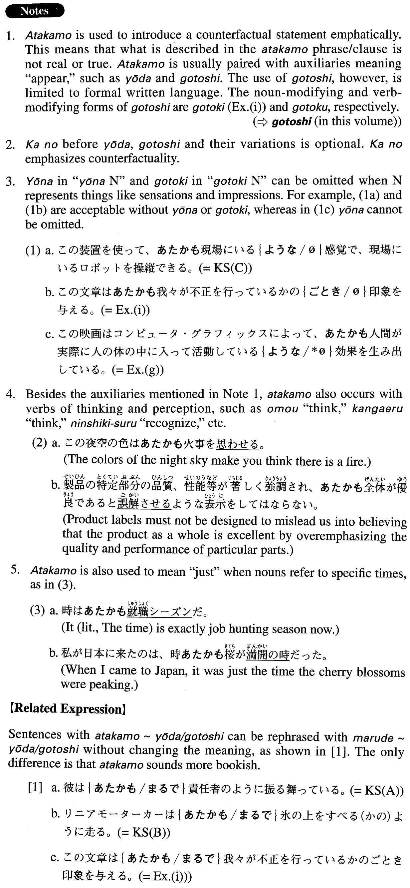

# あたかも

[1. Summary](#summary) 
[2. Formation](#formation) 
[3. Example Sentences](#example-sentences) 
[4. Grammar Book Page](#grammar-book-page) 

## Summary

<table><tr>   <td>Summary</td>   <td>An adverb used to present a counter-factual statement emphatically</td></tr><tr>   <td>Equivalent</td>   <td>(just) as if ~ were; (just) as if ~ did ~; just like; just; exactly</td></tr><tr>   <td>Part of speech</td>   <td>Adverb (usually used in formal writing and formal speech)</td></tr><tr>   <td>Related expression</td>   <td>まるで; かのように</td></tr></table>

## Formation

<table class="table"><tbody><tr class="tr head"><td class="td">(i) あたかもNoun</td><td class="td">の{ように/ようなNoun}</td><td class="td"></td></tr><tr class="tr"><td class="td"></td><td class="td">あたかも上司の{ように/ような言い方}</td><td class="td">As if someone were a supervisor; a way of talking as if someone were a supervisor</td></tr><tr class="tr head"><td class="td">(ii) あたかも{V/Adjectiveい}informal</td><td class="td">(かの){ように/ようなNoun}</td><td class="td"></td></tr><tr class="tr"><td class="td"></td><td class="td">あたかもよく知って{いる/ いた}(かの){ように/ような言い方}</td><td class="td">As if someone knew/had known something well; a way of talking if someone knew/had known something well</td></tr><tr class="tr"><td class="td"></td><td class="td">あたかも{安い/安かった}(かの){ように/ような言い方}</td><td class="td">As if something were/had been cheap; a way of talking as if someone were/had been cheap</td></tr><tr class="tr head"><td class="td">(iii) あたかも{Noun/Adjectiveな stem}</td><td class="td">{である/であった}(かの){ように/ようなNoun}</td><td class="td"></td></tr><tr class="tr"><td class="td"></td><td class="td">あたかも専門家{である/であった}(かの){ように/ような言い方}</td><td class="td">If someone were/had been a specialist; a way of talking as if someone were/had been a specialist</td></tr><tr class="tr"><td class="td"></td><td class="td">あたかも上手{である/であった}(かの){ように/ような言い方}</td><td class="td">If someone were/had been good at something; a way of talking as if someone were/had been good at something</td></tr></tbody></table>

## Example Sentences

<table><tr>   <td>彼はあたかも責任者のように振る舞っている。</td>   <td>He behaves as if he were the person in charge.</td></tr><tr>   <td>リニアモーターカーはあたかも氷の上をすべる（かの）ように走る。</td>   <td>The linear motor car runs as if it were gliding on ice.</td></tr><tr>   <td>この装置を使って、あたかも現場にいる(かの)ような感覚で現場にいるロボットを操縦できる。</td>   <td>Using this device you can operate a robot at the site as if you were actually there.</td></tr><tr>   <td>この磁石はあたかも永久磁石のように動作する。</td>   <td>This magnet acts as if it were a permanent magnet.</td></tr><tr>   <td>リモートコントロールソフトは遠くのPCのデスクトップ画面をそのまま手元のPCに映し出し、あたかも自分のデスクトップのように操作することができる。</td>   <td>A remote control software program displays the desktop of a remote personal computer on the computer in front of you and enables you to operate it as if it were your own computer's desktop.</td></tr><tr>   <td>彼女はあたかも自分のうちにいるように振る舞っている。</td>   <td>She behaves as if she were in her own house.</td></tr><tr>   <td>上手な説明文は、あたかも目の前にその光景が広がっているように鮮明にイメージできるものです。</td>   <td>With well-written explanatory sentences, the reader can get vivid images, as if the scenes were spread out in front of his eyes.</td></tr><tr>   <td>彼はあたかも自分が上司であるかのように私に仕事を言いつける。</td>   <td>He gives me assignments as if he were my boss.</td></tr><tr>   <td>連結納税制度とは、企業グループがあたかも一つの法人であるかのように捉えて、納税させる仕組みです。</td>   <td>The linked tax payment system is a mechanism by which a group of companies is viewed and made to pay taxes as if they were a single corporation.</td></tr><tr>   <td>この映画はコンピュータ・グラフィクスによって、あたかも人間が実際に人の体の中に入って活動しているような効果を生み出している。</td>   <td>Using computer graphics, this movie creates the effect of people actually working and playing inside someone's body.</td></tr><tr>   <td>私はあたかも空を飛んでいるかのような錯覚を覚えた。</td>   <td>I felt as if I were flying (literally: I had the illusion of flying) through the air.</td></tr><tr>   <td>この文章はあたかも我々が不正を行っているかのごとき印象を与える。</td>   <td>These sentences give people the impression that we are doing something dishonest.</td></tr></table>

## Grammar Book Page

